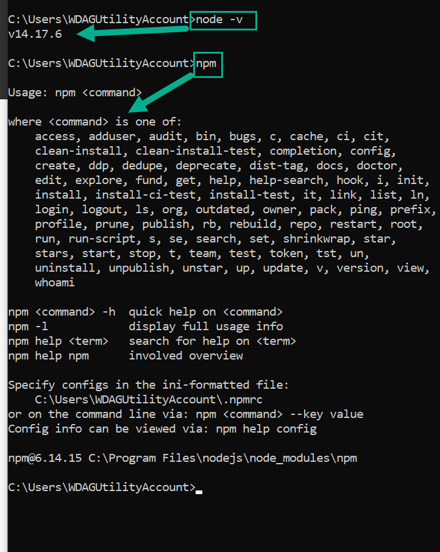

# materiel_du_cours
Matériel pour le cours 420-345-AL

# Date Importantes:

* 2021-10-22 : cours
* 2021-10-26 : cours + Présentation du TP2
* 2021-10-27 : Cours virtuel - Presentation des difficultés du TP-1
* 2021-10-29 : Journée pedagogique, je serais disponible pour ceux qui ont des questions TP ou cours ou Borderlands
* 2021-10-02 : cours
* 2021-10-03 : cours virtuel
* 2021-10-05 : cours
* 2021-11-07 : Limite pour remise TP2
* 2021-11-09 : cours
* 2021-11-10 : cours virtuel
* 2021-11-12 : Examem mi-session + Presentation du TP Final
* 2021-11-16 : cours
* 2021-11-17 : cours virtuel
* 2021-11-19 : cours + Evaluation des enseignments
* 2021-11-23 : cours
* 2021-11-24 : cours virtuel
* 2021-11-26 : cours
* 2021-11-30 : cours
* 2021-12-01 : cours virtuel
* 2021-12-03 : cours
* 2021-12-07 : cours
* 2021-12-10 : cours
* 2021-12-xx : Examem Final
* 2021-12-xx : Remise TP Final
* 

# Installation des Logiciels à installer 

## Nodejs 

Installer à partir de https://nodejs.org/en/. Installer la version LTS (Support à long terme) 

Après l’installation vérifier que les commandes suivantes fonctionnent à partir d’un command shell : 

## Typescript 

Installer Typescript en utilisant NPM dans un command shell.  

* `npm install -g typescript`

Vous pouvez vérifier que typescript est installé en utilisant `tsc`

# Angular CLI 

Installer Angular CLI en utilisant la commande : 

`npm install -g @angular/cli`

Pour vérifier l’installation écrire `ng`

# Demo application 

Utiliser Angular CLI pour créer un application. 

* Ouvrir un command shell (Ou un git bash)
* Aller dans un répertoire pour créer votre projet 
* Utiliser `ng new bonjour`
  * Ceci va créer un project bonjour dans votre répertoire 
  * Répondre : 
    * Would you like to add Angular routing? `No `
    * Which stylesheet format would you like to use? `CSS `
* Après l’installation aller dans le répertoire bonjour 
* Démarrer l’application de démo Angular en utilisant `ng serve` 

[Shell](images/angular_shell.png)

Ouvrir un navigateur internet à l’adresse indiqué par la commande `ng serve `

[Example Default](images/app_default.png)
 
Avec un éditeur modifier le fichier `app_components.ts` dans le répertoire app/src 

Modifier bonjour pour autre chose 

Observez que ng serve va détecter le changer et mettre à jour le projet ce qui aura comme effet de mettre à jour la page dans votre navigateur. 
