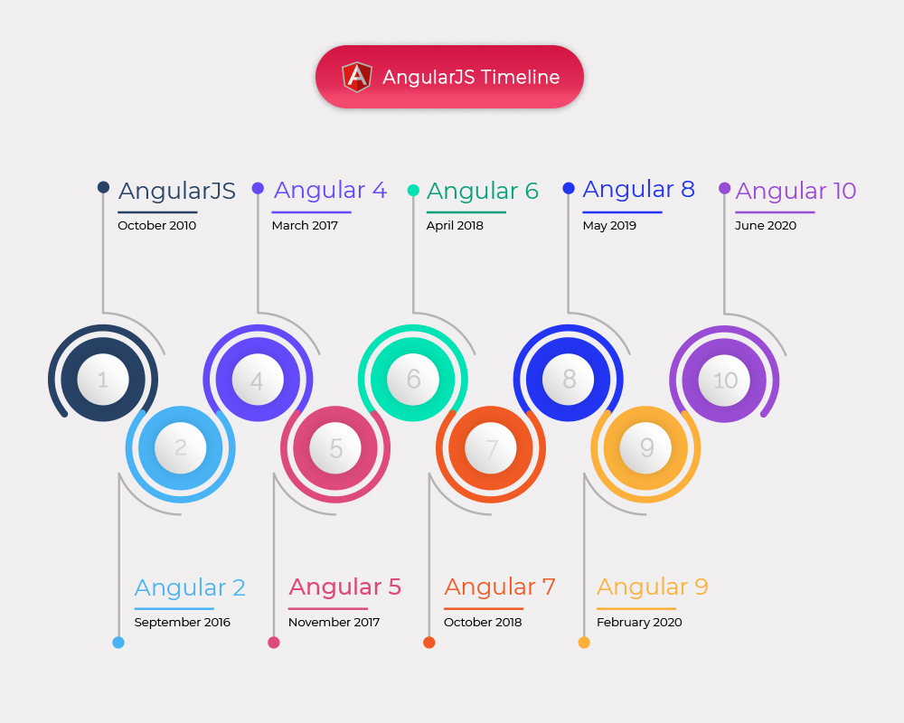
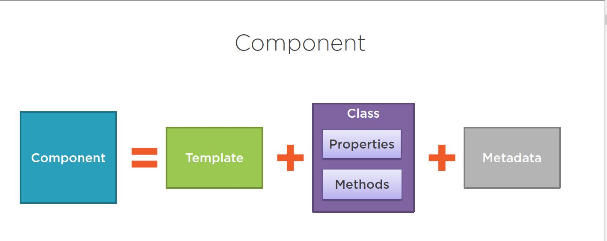
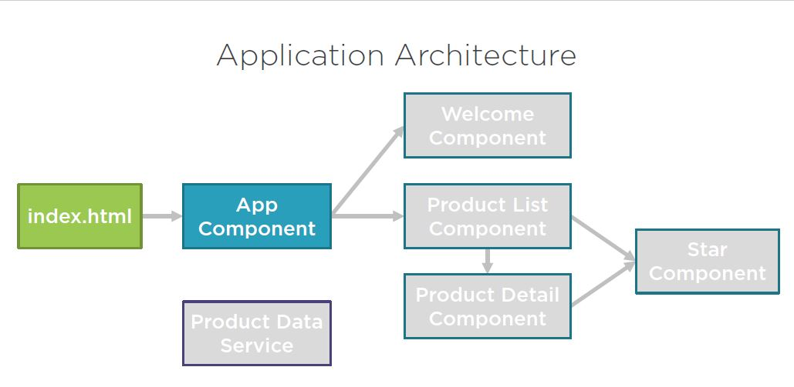
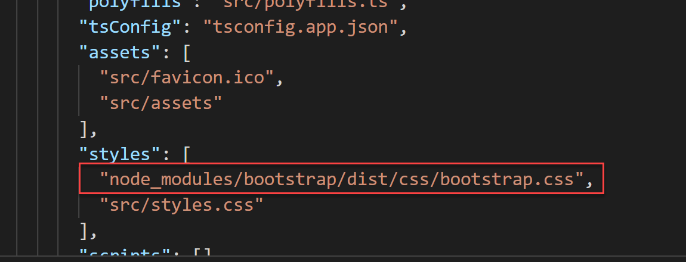
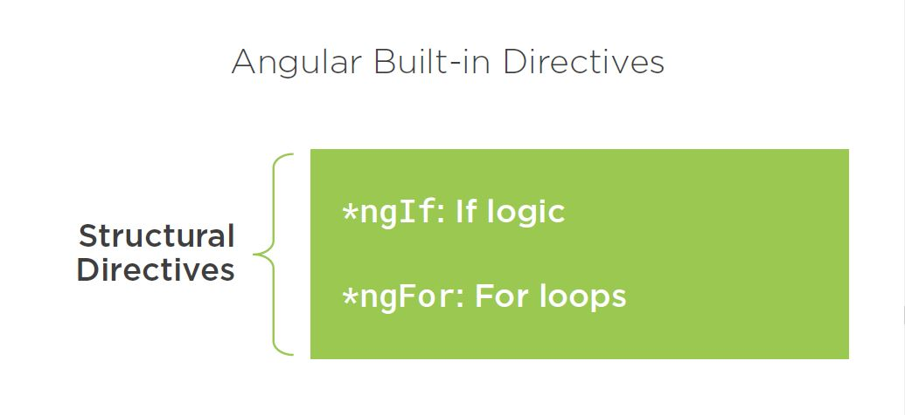
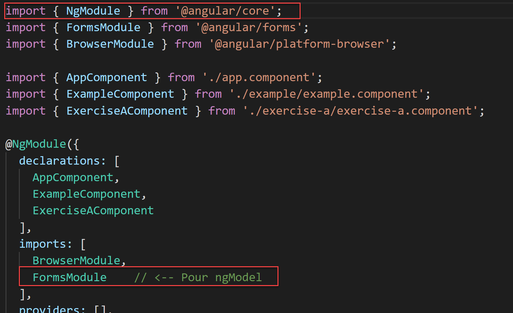
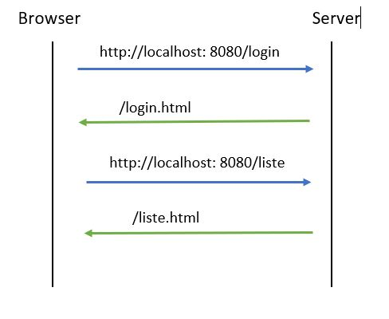
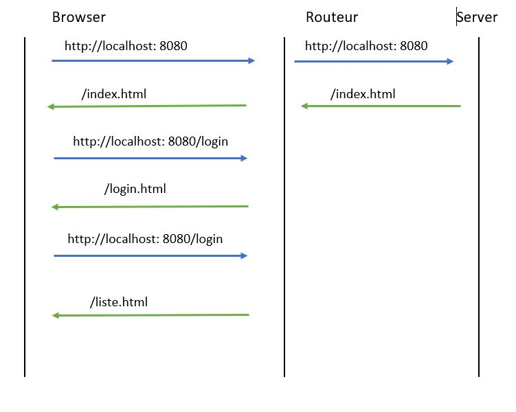
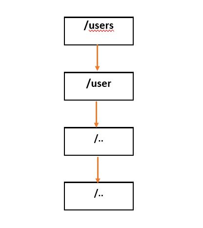
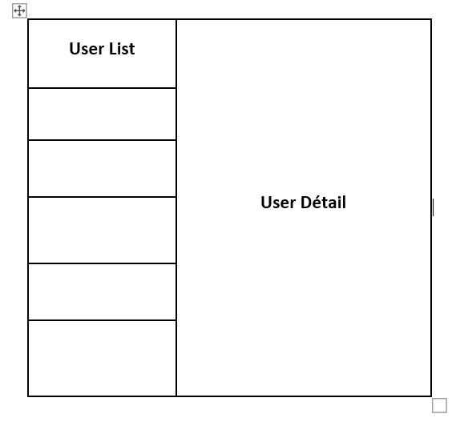

# Angular

## Timeline


ref(https://www.bootstrapdash.com/angular-release-date/)

Une version a tous les 6 moins
** Compatibilité conservé entre chaque relâche **

## Quelques notes historiques

🌿 La confusion Angular?

La plupart des gens connaissaient la première version d'Angular sous le nom d'Angular 1; il est devenu plus tard connu sous le nom d'AngularJS, mais beaucoup l'appellent encore Angular 1. Il n'utilisait pas le contrôle de version sémantique.

🌿  Puis Angular 2 est arrivé, et en 2016, il a atteint sa capacité de production. Angular a décidé d'adopter le versionnage sémantique, ce qui a causé un peu de confusion dans la communauté des développeurs, surtout quand il a annoncé qu'il y aurait un Angular 4 et 5 et ainsi de suite. 

🌿 L'équipe Angular, ainsi que le réseau de leurs experts en développement Google, ont commencé à expliquer que nous devrions appeler la dernière version du framework Angular, juste Angular. 

🌿 Vous pouvez faire valoir la sagesse de cette décision. Il n'en reste pas moins que le nouvel Angular utilise le versionnage sémantique, ce qui signifie qu'Angular est la même plate-forme qu'Angular 2, ainsi qu'Angular 10, et ainsi de suite. 

***
🌿 Angular représente une réécriture complète du framework AngularJS, introduisant une toute nouvelle architecture d'application construite entièrement à partir de zéro en TypeScript, un sur-ensemble strict de JavaScript qui ajoute le typage statique facultatif et la prise en charge des interfaces et des décorateurs.

🌿 En un mot, les applications angulaires sont basées sur une conception d'architecture qui comprend des arbres de composants Web interconnectés par leur interface d'E/S particulière. Sous le capot, chaque composant profite d'un mécanisme **d'injection de dépendance** (IOC: Inverse Of Control) entièrement repensé.

🌿 Pour être juste, il s'agit d'une description simpliste de ce qu'est réellement Angular; 

***
# Configuration
#### Pré-requis

#### 🌼 Node.js
>Node.js est un moteur d'exécution JavaScript basé sur le moteur JavaScript v8 de Chrome. Angular nécessite une version actuelle ou LTS. Si vous l'avez déjà installé, vous pouvez exécuter node -v dans la ligne de commande pour vérifier la version que vous utilisez. 
Sinon, vous pouvez l'obtenir sur https://nodejs.org.
Angular **CLI**utilise **Node.js** pour accomplir des tâches spécifiques, telles que le service, la création et le regroupement de votre application.

#### 🌼 Npm
>Npm est un gestionnaire de progiciels inclus par défaut dans Node.js. Vous pouvez vérifier cela en exécutant **npm -v** dans la ligne de commande. Le framework Angular est un écosystème de diverses bibliothèques, appelées packages, qui sont disponibles dans un emplacement central appelé registre **npm**. Le client **npm**télécharge et installe les bibliothèques nécessaires pour exécuter votre application à partir du registre.

#### 🌼 Git
>Git est un client qui nous permet de nous connecter à des systèmes de contrôle de version distribués, tels que GitHub, Bitbucket et GitLab. Il est facultatif du point de vue de la CLI angulaire. Vous devriez l'installer au cas où vous voudriez télécharger votre projet Angular dans un référentiel Git, ce que vous voudrez peut-être faire.

***
#### 🌼 Installation Angular CLI (Command Line Interface)
La CLI Angular fait partie de l'écosystème Angular et est disponible au téléchargement à partir du registre de packages npm. Puisqu'il est utilisé pour créer des applications et des projets angulaires, nous devons l'installer globalement dans notre système. Ouvrez un terminal et exécutez la commande suivante:
> * npm install -g @angular/cli

#### Les commandes CLI
🔸 [Lien vers un fichier PDF contenant des commandes](angular_cli_commands.pdf)

# Tour d'horizon d'Angular

## Fichier initiaux

Lorsqu'on crée un projet Angular il y a les éléments suivant qui sont crées

```shell
ng new empty
? Would you like to add Angular routing? No
? Which stylesheet format would you like to use? CSS
CREATE empty/angular.json (3033 bytes)
CREATE empty/package.json (1067 bytes)
CREATE empty/README.md (1051 bytes)   
CREATE empty/tsconfig.json (783 bytes)
CREATE empty/.editorconfig (274 bytes)
CREATE empty/.gitignore (604 bytes)
CREATE empty/.browserslistrc (703 bytes)
CREATE empty/karma.conf.js (1422 bytes)
CREATE empty/tsconfig.app.json (287 bytes)
CREATE empty/tsconfig.spec.json (333 bytes)
CREATE empty/src/favicon.ico (948 bytes)
CREATE empty/src/index.html (291 bytes)
CREATE empty/src/main.ts (372 bytes)
CREATE empty/src/polyfills.ts (2820 bytes)
CREATE empty/src/styles.css (80 bytes)
CREATE empty/src/test.ts (788 bytes)
CREATE empty/src/assets/.gitkeep (0 bytes)
CREATE empty/src/environments/environment.prod.ts (51 bytes)
CREATE empty/src/environments/environment.ts (658 bytes)
CREATE empty/src/app/app.module.ts (314 bytes)
CREATE empty/src/app/app.component.html (24585 bytes)
CREATE empty/src/app/app.component.spec.ts (953 bytes)
CREATE empty/src/app/app.component.ts (209 bytes)
CREATE empty/src/app/app.component.css (0 bytes)
```

## Modules

Créer un module ajoute 4 fichier du nom du component que l'on ajoute

```shell
ng g c newcomponent
CREATE src/app/newcomponent/newcomponent.component.html (27 bytes)
CREATE src/app/newcomponent/newcomponent.component.spec.ts (668 bytes)
CREATE src/app/newcomponent/newcomponent.component.ts (299 bytes)
CREATE src/app/newcomponent/newcomponent.component.css (0 bytes)
UPDATE src/app/app.module.ts (420 bytes)
```

## Model

Par convention on crée un répertoire model pour contenir notre définition de model pour notre application

## Service

Un répertoire service pourra être crée pour inclure notre code d'interface pour nos composante et le model

# MVC

🌿 Component, Templates, Interpolation, et Directives ?



*** 
🌿 Exemple d'architecture d'une application Angular 10.


🌼  Nous allons créer l'interface utilisateur à l'aide de modèles, de directives et de liaisons de données. 

🌼   Angular nous donne la liaison de données afin que nous puissions facilement afficher des informations et répondre aux actions de l'utilisateur. Avec les directives angulaires, nous ajoutons une logique à notre code HTML, telle que les instructions if et les boucles for. 

🌼 Et avec les composants Angular, nous construirons des fragments d'interface utilisateur imbriqués (ex : Images).

🌼 Nous avons vu qu'un composant angulaire est une vue définie avec un modèle, son code associé défini avec une classe et des informations supplémentaires définies avec des métadonnées et définies à l'aide d'un décorateur de composant. 

# Application Angular

Regardons les bases d'une application angular

## empty

Allons dans le folder `empty` et roulons ng serve. Ouvrir un browser sur [http://localhost:4200/]

La page est vide yeah!

* Ajoutons du html dans app.components.html
* Le Html apparait
  * mais! pourquoi? est-ce notre index.html?
  * component vs selector vs attribute vs class vs id
  * View source (Regardons le flow)
    * index + script
    * load main.ts
    * load app modules
    * load app components
    * load ... (DOM rewrite)


🌿 Quelques définitions

🌿  **L'interpolation** (contrôle des attributs) : La syntaxe d'interpolation permet d'accéder directement aux propriétés du composant associé (un peu comme si toutes les expressions étaient préfixées par un this . 
Exemples 👍 
* **`{{ titre }}`**
* **`<h1>{{ titre }}</h1>`**
* **`{{'Titre: ' + titre }}`**
* **`{{ 2*20+1 }}`**
* **`{{ 'Titre: ' + getTitre() }}`**
* **`<h1 innerText={{pageTitre}}></h1>`**

### Exercise : Premier pas
> * Créer une application Angular
> * Ajoutez le module bootstrap
>   * Utiliser npm pour ajouter bootstrap dans le répertoire node_modules `npm install bootstrap`
>   * Dans le fichier angular.json dans la section css ajouter `node_modules/bootstrap/dist/css/bootstrap.css`
> 
> * Dans votre app.component.html vous pouvez utiliser bootstrap pour contoller la structure de votre page et de ses éléments.
> * Dans la class AppComponent (app.component.ts)
> * Créez une variable avec une chaine de text
> * Mettre du HTML dans le app.component.html pour afficher le contenu de votre variable

DIDIER: Group 1 est ici

# Les directives

[Documentation](https://angular.io/guide/built-in-directives)



🌼 Alors que le **`Template `**Interpolation et la propriété **`Binding `**permettent de modifier l'affichage et le contenu, ils ne permettent pas de modifier la structure du DOM en ajoutant ou en retirant des éléments par exemple.

🌼 Pour remédier à cette limitation, Angular fournit des directives structurelles qui permettent de modifier la structure du **`DOM`**.

> Les directives que nous allons utiliser existes dans le framework angular. Cependant il est possible de créer des directives avec le decorateur  `@Directive`

```Typescript
@Directive({
    selector: '[myDirective]'
})
export class LeCodeDeMaDirective {
    ...
}
```

### **Directive NgIf**

🌼 L'une de ces directives les plus utilisées est le **`NgIf`**. Si l'expression associée à la directive est **`false `**alors l'élément et son contenu sont retirés du **`DOM`** (ou jamais ajoutés).

**`<button *ngIf="isAvailable">OUVERT</button>`**

**`export class AppComponent {`**
    **`isAvailable = false;`**
**`}`**

**[NgIf Angular documentation](https://angular.io/api/common/NgIf)**

**[switch Angular documentation](https://angular.io/api/common/NgSwitch)**

### Exercise : 
> * Ajouter un booleen dans le appcomponent.ts de l'exercise précédant et affichez du contenue si le booleen est vrai ou faux

🌼 **Directive NgFor**

La directive structurelle NgFor permet de boucler sur un tableau et d'injecter les éléments dans le DOM.

🌿  **Dans la vue**

```html
<ul>
    <li *ngFor="let livre of listeLivres">{{ livre.titre}}</li>
</ul>
```

🌿  **Dans le composant**

```typescript
listeLivres = [
        {
            titre: 'Angular 10'
        },
        {
            titre: 'Java 8'
        }
    ];
```

### Exercise : 

Toujours en utilisant le projet que vous avez crée ajouter les éléments suivants:

> * Créez un vecteur de avec la liste de livres affiche plus haut
> * En utilisant la directive NGfor affichez votre liste de livre

# Components

[Documentation](https://angular.io/guide/component-overview)

Une application est construite en "component" chaque components peuvent être groupés pour contruire une application.

Example l'application pour le TP final aura plusieurs "components" qui servirons à la création de l'application.

DIDIER: Group 2 est ici

### Exercise : Component

On va ajouter deux composants à l'intérieur notre exercise initial. 

> * Creez un component en utilisant le CLI:
>   * `ng generate component alpha`
> * Modifier le html de votre component pour y mettre du html
> * Verifier dans votre application si vous voyez le text de votre nouveau component
> * Ajouter une référence a votre component dans le app.component.html
> * Creez un autre component beta **mais sans utiliser la commande ng** référez-vous au premier component pour voir ce que vous devez ajouter.
>   * Ici le but est de regarder les fichiers qui furent crées pour le project Alpha et crée des fichiers similaire pour contruire un component beta
>   * Il va y avoir un fichier qui a reçu une autre modification pour inclure le nouveau module, vous devrez le trouver et le modifier pour ajouter votre module beta.
> * Dans le component alpha, affichez le contenue du component beta 2 ou trois fois

## @component

* Selector
  * Nom de notre component
* templateUrl
  * Location de notre template HTML
  * On peut le remplacer par template avec du HTML
    * '' vs ``
* styleUrls
  * Vecteur des fichiers CSS pour notre component

# Styling using CSS

Chaques components peuvent inclure du CSS pour ajuster le style pour les éléments du component.

### Exercise

> * En ajoutant à l'intérieur du fichier CSS pour le composant Alpha changer le stype pour p ou h1 pour mettre un background color bleu
> * Observer la couleur dans votre application
>   * Est-ce que la couleur que vous avez mis dans le component alpha impact le component beta qui est affiché dans Alpha?
> * A l'interieur de Beta en remplacant le @component pour utiliser style au lieu de style URL et changer le background color red.
> * Observez le résultat
> * Question pourquoi il n'y a pas de conflit pour les styles?

### Exercise: [resultats](exercises/resultats)

# Debut livre de recette

Pour Didier: https://github.com/didiertremblay/recettes/compare/v0...v8

Dans le répertoire angular un répertoire recettes contient le début de l'application livre de recette qui sera vu en classe pour intégrer les notions angular dans une application. 

Pour éxécuté en local le code déposé vous devrez installer le dépendance pour npm en executant la commande `npm i`. Par la suite vous pourrez démarrer le serveur en utilisant `ng serve`

### Exercise: Suivant la meme structure créez un application affichant un journal de voyage.

> * Creez le git `pratique-pour-tp` un nouveau projet Angular
> * Créez un repertoire model dans lequel vous allez mettre le model que vous avez créé dans un exercise précédent pour le **Journal de voyage**
>   * Voir [Recettes](../typescript/exercises/Recettes/readme.md)
> * Créez une premiere version ou vous affichez une vue des différents voyages. Vous n'avez pas a vous préoccupé de la forme juste afficher les informations sommaire et pas besoin d'images pour le moment. Aux cours des differents cours vous aurez l'occasion de modifier cette base en une application plus fonctionnel.

> **Pour le journal de voyage, il n'y aura pas de corrigé fourni. Cette composante est un élément qui fait parti du TP final et sera à intégrer et évaluer avec le travail de fin d'année.** 

# Bindings

"Bindings" permet de specifier un lien entre Angular entre les variables de notre class et le template. L'interpolation `{{}}` vu précédement

Affichage des informations

```shell
                       Interpolation
<typescript>             {{abc}}             
eg AppComponent class   =========>     html/Template
                      [property]="data"
                      Property Binding
```

Recevoir des informations

```shell
                       Event Binding
<typescript>          (event)="expression"        
eg AppComponent class   <========     html/Template
```

Recevoir des informations

```shell
                       Event Binding
<typescript>          (event)="expression"        
eg AppComponent class   <========     html/Template
```

Exchange bi directionel

Recevoir des informations

```shell
                          To Way Binding
<typescript>            [(ngModel)]="data"        
eg AppComponent class       <========        html/Template
```

### Exercise : Binding

On a fait précédament un affichage de nos variables dans notre module. 

> * Comment rendre ce bouton disabled avec une variable.
>   * Créez une variable bouton_actif qui est mis a false
>   * Dans notre constructeur appelez la function setTimeout pour changer l'état de la variable a true (!!! important utiliser un arrow function sinon votre this pour votre constructeur ne fonctionnera pas!!!)
> * Dans le app.component.html de cette exercise ajoutons deux boutons
>   * Mettre le premier bouton disabled
>   * Mettre le deuxieme bouton disabled={{bouton_actif}}
>       * Ce binding permet de lier un property avec une expression typescript.
>   * Le property pourrait aussi être utilisé pour afficher le text d'un élément avec `<p [innerText]="bouton_actif"></p>`

### Exercise : Event Binding

Ici nous allons capturer une action sur notre bouton pour engendrer un changement dans notre application.

> * Maintenant on va faire quelquechose avec notre bouton lorsqu'il est actif
> * Dans notre deuxieme bouton ajouter `(click)="onButtonClick()"
> * Dans votre class application crée un méthod onButtonClick qui change une variable dans votre code

Tous les types d'événement javascript peuvent être utilisé et dans les scenarios ou les événements possède des données ces données sont disponible par la variable `$event`

> * Ajoutez un `input` pour du texte
> * Dans cet `input` ajoutez le event binding pour input `(input)="inputOfText($event)`
> * Créez une fonction qui affiche le contenu du parametre recu (Utilisé any comme type)
>   * Si on veut éviter Le type any pour cette évenement est un Event.. L'utiliser cependant requiert d'utiliser un casting `HTMLInputElement` 
> * Afficher le contenu de l'événement dans le console log.
> * Prendre la valeur de l'input et la mettre dans une variable que vous avez crée précédament pour y voir le texte que vous entrez.

### Exercise: Two way binding

[Documentation](https://angular.io/guide/two-way-binding#how-two-way-binding-works)

Souvent l'information capturé doit être réutilisé pour mettre à jour un élément dans le template. Dans ce scenario nous relions la template avec une variable ainsi que la variable avec la template.

> * Créez un nouvel `input` pour ajouter du texte
> * Dans cet `input` ajoutez un two way binding en utilisant `[(ngModel)]="variable"` ou variable est la variable que vous avez utlisé dans l'exercise précédent.
>   * ngModel ne sera pas reconnu et doit être ajouter dans appModule



> * Créez un nouvel `input` pour ajouter du texte

Est-ce que tout fonctionne???? Qu'elle est la difference entre nos deux inputs?

### Exercise : [Binding](angulare/exercises/binding)

# DIDIER: TO WORK ON THE NEXT STEPS

# Passage de parametre entre components

Jusqu'à présent nous avons vu que nous pouvons créer plusieurs components et avoir un component utilisé un autre component. Cependant notre utilisation de l'autre component se limite à afficher simplement son contenu. Comment utiliser le component pour lui demander d'afficher de l'information fournis par le parent?

Pour faire ce passage d'information angular fournit le décorateur `@input` [Documentation](https://angular.io/guide/inputs-outputs)

DIDIER: https://github.com/didiertremblay/recettes/compare/v8...v9

Pour démontrer ce processus nous allons modifier l'application de recettes pour créer un nouveau component qui aura comme responsabilité d'afficher un sommaire pour une recette.

> * Créons un component sommaire-recette
> * Dans sommaire-recette nous allons ajouter un attribut recette pour lequel nous allons décoré de `@Input()` pour lui permettre de recevoir l'information de sont parent
> * On va déplacé le contenu qui correspond au sommaire dans le html du nouveau component
> * Ainsi que le CSS requis pour l'imgae
> * Dans le parent au lieu du sommaire on va utiliser le selecteur de notre nouveau component en passant notre recette qui est a afficher `[recette]="recette` (Hum?! meme nom :()

Donc

### Exercise, faire la même transformation avec votre Journal de voyage.


## DIDIER TO ADD Cover

- [ ] ngStyle
- [ ] ngClass
- [ ] Distribuer l'avancement du livre de recette
- [ ] Barre de navigation
- [ ] Model
- [ ] Directive
- [ ] CSS
- [ ] Form Validation methods
- [ ] Service
- [ ] Event Emitter
- [ ] Observable
- [ ] RxJS - Chat app?
  - [ ] Mouse move?
- [ ] Filter | Pipe
- [ ] Testing


# NE PAS CONTINUER DOIS ETRE AJUSTÉ
# NE PAS CONTINUER DOIS ETRE AJUSTÉ
# NE PAS CONTINUER DOIS ETRE AJUSTÉ
# NE PAS CONTINUER DOIS ETRE AJUSTÉ

🌿 Le but des services d'Angular 

Les services angulaires sont des objets **Singleton** qui ne sont instanciés qu'une seule fois pendant la durée de vie d'une application. Ils contiennent des méthodes qui conservent les données tout au long de la vie d'une application, c'est-à-dire que les données ne sont pas actualisées et sont disponibles à tout moment. 

🌿 L'objectif principal d'un service est d'organiser et de partager la logique métier, les modèles ou les données et fonctions avec différents composants d'une application Angular.

🌿 Pourquoi utiliser les services en Angular?
La séparation des préoccupations (besoins ou exigences) est la principale raison pour laquelle les services angulaires ont vu le jour. Un service Angular est un objet sans état et fournit des fonctions très utiles. Ces fonctions peuvent être appelées à partir de n'importe quel composant d'Angular, comme les contrôleurs, les directives, etc. Cela aide à diviser l'application Web en petites unités logiques différentes qui peuvent être réutilisées.

🌿 Par exemple : Une application Angular peut avoir plusieurs contrôleurs (, pour récupérer les données requises par l'ensemble de l'application. Faire un appel AJAX au serveur à partir du contrôleur est redondant, car chaque contrôleur utilisera un code similaire pour faire un appel pour les mêmes données. 

🌿 Dans de tels cas, il est extrêmement utile d'utiliser un service, car nous pouvons écrire un service contenant le code pour récupérer les données du serveur et injecter le service dans le contrôleur. 

🌿 Les services auront des fonctions pour passer un appel. Nous pouvons utiliser ces fonctions de services dans le contrôleur et faire des appels au serveur, de cette façon nous n'avons pas besoin d'écrire à nouveau le même code et il peut également être utilisé dans des composants autres que les contrôleurs. De plus, les responsables du traitement n'ont plus à effectuer la tâche de récupération des données, car les services s'en chargent, atteignant ainsi l'objectif de séparation des préoccupations.

***

🌿 Qu’est-ce qu’un patron de conception (Design Pattern) ?

🌼 Les patrons de conception sont des solutions classiques à des problèmes récurrents de la conception de logiciels. Ce sont des sortes de plans ou de schémas que l’on peut personnaliser afin de résoudre un problème récurrent dans notre code.

🌼 Vous ne pouvez pas vous contenter de trouver un patron et de le recopier dans votre programme comme vous le feriez avec des fonctions ou des librairies prêtes à l’emploi. Un patron, ce n’est pas un bout de code spécifique, mais plutôt un concept général pour résoudre un problème précis. Vous pouvez suivre le principe du patron et implémenter une solution qui convient à votre propre programme.

🌼 Les patrons sont souvent confondus avec les algorithmes, car ils décrivent tous deux des solutions classiques à des problèmes connus. Un algorithme définit toujours clairement un ensemble d’actions qui va vous mener vers un objectif, alors qu’un patron, c’est la description d’une solution à un plus haut niveau. Le code utilisé pour implémenter un même patron peut être complètement différent s’il est appliqué à deux programmes distincts.

🌼 Un algorithme c’est un peu comme une recette de cuisine, ses étapes sont claires et vous guident vers un objectif précis. 

🌼 Un patron, c’est plutôt comme un plan : vous pouvez voir ses fonctionnalités et les résultats obtenus, mais la manière de l’implémenter vous revient.

🌿 Que trouve-t-on dans un patron de conception ?

🌼 La majorité des patrons sont présentés de façon très générale, afin qu’ils soient reproductibles dans tous les contextes. Voici les différentes sections que vous retrouverez habituellement dans la description d’un patron :

* L’Intention du patron permet de décrire brièvement le problème et la solution.
* La Motivation explique en détail la problématique et la solution offerte par le patron.
* La Structure des classes montre les différentes parties du patron et leurs relations.
* L’Exemple de code écrit dans un des langages de programmation les plus populaires facilite la compréhension générale de l’idée derrière le patron.

***
* 🍄  [Exercice1](#Théorie)
***

* Définir Angular ?
* Décrivez brièvement l’architecture d’un projet Angular 10 ?
* Expliquez brièvement (clairement) le rôle du fichier « package.json »?
* Expliquez brièvement (clairement) le rôle du fichier « angular.json »?
* Définir les termes suivants :
  * Selector 
  * templateUrl 
  * template
  * styleUrls 
  * style
* Quel est le rôle de NPM?
* Quels sont les avantages de l'utilisation d'Angular?
* À quoi sert Angular principalement ?
* Quelles sont les expressions angulaires?
* Expliquez les interpolations ?

***
[Aide mémoire Angular 10](dzone-refcard206-angular.pdf)


### Introduction au routeur Angular

🌼 Dans les applications Web traditionnelles, lorsque nous voulions passer d'une vue à une autre, nous devions demander une nouvelle page au serveur. Le navigateur créerait une URL pour la vue et l'envoyait au serveur. 

♣️ Dès qu'une réponse était reçue du serveur, le navigateur rechargeait la page. Ce processus a entraîné des retards aller-retour et une mauvaise expérience utilisateur pour nos applications :



♣️ Le framework Angular fournit le package npm @angular/router, que nous pouvons utiliser pour naviguer entre différents composants dans une application Angular 10. L'ajout d'un routage dans une application angulaire implique les étapes suivantes :

1. Spécifiez le chemin d'accès de base de l'application Angular.
2. Utilisez un module angulaire approprié du package @angular/router.
3. Configurez différentes routes pour l'application Angular.
4. Décidez où orienter (diriger) les composants lors de la navigation.
 
🔸 Les applications Web modernes qui utilisent un framework JavaScript tel que Angular suivent une approche différente. Ils gèrent les changements entre 
   les vues ou les composants côté client sans déranger le serveur. Ils ne contactent le serveur qu'une seule fois lors du démarrage pour obtenir le 
   fichier principal index.html. Toutes les modifications ultérieures d'URL sont interceptées et gérées par le routeur sur le client. Ces types 
   d'applications sont appelées applications à page unique (SPA) car ils ne provoquent pas un rechargement complet d'une page :



***
# point-2
### Spécification

> Comme nous l'avons déjà vu, les applications Web modernes et traditionnelles réagissent différemment lorsqu'une URL change dans l'application. 
> L'architecture de chaque navigateur joue un rôle essentiel dans ce comportement. 

> Les navigateurs plus anciens lancent une nouvelle requête au serveur lorsque l'URL change. 

> Les navigateurs modernes, également appelés navigateurs HTML5, peuvent modifier l'URL et l'historique du navigateur, lors de la navigation dans différentes vues, sans envoyer de requête au serveur en utilisant une technique appelée HTML5 pushState.

```typescript
HTML5 pushState permet la navigation dans l'application sans provoquer un rechargement complet 
de la page et est pris en charge par tous les navigateurs modernes.
```
Une application Angular doit définir la balise HTML de base dans le fichier index.html pour activer le routage pushState :

```html
<!doctype html>
<html lang="en">
<head>
  <meta charset="utf-8">
  <title>MyApp</title>
  <base href="/">
  <meta name="viewport" content="width=device-width,   initial-scale=1">
  <link rel="icon" type="image/x-icon" href="favicon.ico">
</head>
<body>
  <app-root></app-root>
</body>
</html>
```

🌼 L'attribut **href** informe le navigateur sur le chemin qu'il doit suivre lorsqu'il tente de charger des ressources externes, telles que des fichiers multimédias ou CSS, une fois qu'il va plus loin dans la hiérarchie des URL.

🌼 La CLI Angular ajoute la balise de base par défaut lors de la création d'une nouvelle application Angular et définit la valeur **href* sur la racine de l'application, /. Si votre application réside dans un dossier différent de celui de l'application, vous devez la modifier en fonction du nom de ce dossier.

# point-3
### Importation du module routeur
La bibliothèque de routeurs angulaires contient RouterModule, un module angulaire que nous devons importer dans notre application pour commencer à utiliser les fonctionnalités de routage :

```typescript
import { RouterModule } from '@angular/router';
```
Nous importons RouterModule dans le module d'application principal, AppModule, en utilisant le modèle forRoot

```typescript
@NgModule({
  imports: [
    RouterModule.forRoot(routes)
  ]
})
```
La méthode forRoot de RouterModule renvoie un module angulaire qui contient un ensemble d'artefacts angulaires liés au routage :

* Services pour effectuer des tâches de routage courantes telles que la navigation
* Directives que nous pouvons utiliser dans nos composants pour les enrichir avec une logique de navigation

Il accepte un seul paramètre, qui est la configuration d'itinéraire de l'application.

# point-4
### Configurer le routeur
La variable routes que nous transmettons dans la méthode forRoot est une liste d'objets Routes qui spécifient les routes existantes dans l'application et les composants qui doivent répondre à une route spécifique. Cela peut ressembler à ceci :

```typescript
const routes: Routes = [
  { path: 'listes', component: ListesComponent },
  { path: '**', component: PageNotFoundComponent }
];
```

Chaque objet de définition de route contient une propriété de chemin, qui est le chemin URL de la route, et une propriété de composant qui définit quel composant sera chargé lorsque l'application accède à cette route. Notez que la valeur de la propriété path ne contient pas de /.

La navigation dans une application Angular 10 peut se produire soit en modifiant l'URL du navigateur, soit en demandant au routeur de naviguer le long d'un chemin d'itinéraire dans le code de l'application. Dans le premier cas, lorsque l'URL du navigateur contient la route/ listes, le routeur crée une instance de ListesComponent et affiche son modèle sur la page. Au contraire, lorsque l'application navigue vers /listes par code, le routeur suit la même procédure, et en plus, il met à jour l'URL du navigateur.

Si l'utilisateur tente d'accéder à une URL qui ne correspond à aucune route, Angular active un type de route personnalisé appelé route générique. La route générique a une propriété de chemin avec deux astérisques et correspond à n'importe quelle URL. La propriété du composant est généralement un PageNotFoundComponent spécifique à l'application ou le composant principal de l'application.

# point-5
### Rendu des composants
L'une des directives que la bibliothèque de routeurs exporte à l'aide de la méthode forRoot est router-outlet. Il est utilisé comme composant angulaire et agit comme un espace réservé pour les composants activés avec le routage.

En règle générale, l'AppComponent d'une application Angular 10 est utilisé uniquement pour fournir la disposition principale de l'application et orchestrer tous les autres composants. Nous devons l'écrire une fois et l'oublier, et ne pas le modifier lorsque nous voulons ajouter une nouvelle fonctionnalité à notre application. Ainsi, un exemple typique d'AppComponent est le suivant :

```html
<app-header></app-header>
<router-outlet></router-outlet>
<app-footer></app-footer>
```
app-header et app-footer sont des composants de mise en page, et router-outlet est l'endroit où tous les autres composants sont rendus à l'aide du routage. En réalité, ces composants sont rendus comme un élément frère de la directive router-outlet.

Nous avons déjà couvert les bases et fourni une configuration minimale du routeur. Dans la section suivante, nous examinerons un exemple plus réaliste et élargirons davantage nos connaissances sur le module de routage et comment il peut nous aider.

***
# point-5
### Création d'une application angulaire avec routage

```shell
Commande pour créer une application avec le module routing
ng new application --routing --skipTests
```
Cela génère à peu près les mêmes fichiers que d'habitude mais à une exception près, le fichier app-routing.module.ts :

```typescript
import { NgModule } from '@angular/core';
import { Routes, RouterModule } from '@angular/router';
const routes: Routes = [];
@NgModule({
  imports: [RouterModule.forRoot(routes)],
  exports: [RouterModule]
})
export class AppRoutingModule { }
```
Il s'agit d'un module angulaire utilisé pour configurer et activer le routeur dans notre application. Il importe RouterModule en utilisant la méthode forRoot, comme nous l'avons déjà appris dans la section précédente. Il réexporte également RouterModule afin que les composants d'autres modules qui importent AppRoutingModule aient accès aux services et directives du routeur. Par défaut, AppModule importe AppRoutingModule, donc tous les composants de notre application sont activés avec des capacités de routage :

```typescript
import { BrowserModule } from '@angular/platform-browser';
import { NgModule } from '@angular/core';
import { AppRoutingModule } from './app-routing.module';
import { AppComponent } from './app.component';
@NgModule({
  declarations: [
    AppComponent
  ],
  imports: [
    BrowserModule,
    AppRoutingModule
  ],
  providers: [],
  bootstrap: [AppComponent]
})
export class AppModule { }
```
***
# point-7
### Ajout de la configuration de l'itinéraire à notre application Angular

Le module principal de notre application n'a pas encore de configuration d'itinéraire. La variable routes dans AppRoutingModule est un tableau vide. Commençons par le remplir de valeurs :

```html
Créez deux composants angulaires, un nommé user-list et un autre nommé user-detail.

Note importante :

>Étant donné que ces composants vont être activés avec le routage, nous pouvons supprimer en toute sécurité leur propriété selector du décorateur @Component. 

Cependant, il est utile de les laisser inchangés à des fins de débogage car nous pouvons identifier rapidement les composants plus tard dans l'arborescence DOM.

>Ajoutez deux objets de définition d'itinéraire dans la variable routes, un pour chaque composant. 
La route des users activera UserListComponent, et la route du user activera UserDetailComponent:
```

```typescript
const routes: Routes = [
  { path: 'users', component: UsersListComponent },
  { path: 'user', component: UserDetailComponent }
];
```
Maintenant que nous avons configuré le routage de notre application, nous devons simplement apprendre à naviguer vers une route spécifique.

# point-8
### Navigation via les routes

Nous allons utiliser deux directives de routeur pour effectuer la navigation dans notre application, la directive router-outlet que nous avons déjà vue et routerLink. Nous appliquons la directive routerLink pour ancrer les éléments HTML, et nous attribuons le chemin de route dans lequel nous voulons naviguer en tant que valeur. Notez que le chemin commence par / par opposition à la propriété path dans l'objet de définition d'itinéraire. 
Commençons :
* Ouvrez le fichier app.component.html et remplacez tout le contenu par une directive router-outlet.
* Ajoutez un élément HTML de navigation contenant deux balises d'ancrage, une pour chaque composant.
* Ajoutez la directive routerLink à chaque balise et attribuez les chemins respectifs à partir de la configuration d'itinéraire que nous avons créée précédemment :

```html
<nav>
  <a routerLink="/users">Users</a>
  <a routerLink="/user">User</a>
</nav>
<router-outlet></router-outlet>
```
Nous sommes maintenant prêts à prévisualiser notre application Angular. Exécutez ng serve et cliquez sur le lien Users. L'application doit afficher le modèle de UsersListComponent sous l'élément nav. Il doit également mettre à jour l'URL du navigateur pour qu'elle corresponde au chemin de l'itinéraire. Maintenant, essayez de faire le contraire. Accédez au chemin racine, http: // localhost: 4200, et ajoutez le chemin /users à la fin de l'URL.

***
# point-8
### Modules de routage

À ce stade, nous avons configuré l'itinéraire pour que le routage fonctionne comme il se doit. Cependant, cette approche ne s'adapte pas aussi bien. Au fur et à mesure que notre application se développe, de plus en plus de routes peuvent être ajoutées à AppRoutingModule. Ainsi, nous devrions créer un module de fonctionnalités distinct pour nos composants qui aura également un module de routage dédié.

```bash
ng generate module users --routing
```
Le paramètre --routing demande à la CLI angulaire de créer un module de routage avec le module de fonctionnalités users :
* users-routing.module.ts
* users.module.ts

La CLI angulaire nomme le fichier du module de routage après le nom du module de fonctionnalités réel, en ajoutant le suffixe -routing. Il s'agit d'une convention qui nous aide à identifier rapidement si un module de fonctionnalités a le routage activé et lequel est le module de routage du module de fonctionnalités respectif. Le nom de la classe TypeScript du module de routage suit également une convention similaire :

```typescript
import { NgModule } from '@angular/core';
import { Routes, RouterModule } from '@angular/router';
const routes: Routes = [];
@NgModule({
  imports: [RouterModule.forChild(routes)],
  exports: [RouterModule]
})
export class UsersRoutingModule { }
```
Dans l'extrait de code précédent, vous avez peut-être remarqué que nous n'importons pas RouterModule en utilisant la méthode forRoot comme nous l'avons fait auparavant. 

À la place, nous utilisons la méthode forChild pour cela. La méthode forChild est utilisée lorsque nous voulons enregistrer des routes dans un module de fonctionnalités. Vous ne devez appeler la méthode forRoot que dans le module de routage du module d'application principal, AppRoutingModule.

Maintenant que nous avons créé notre module de fonctionnalités et le module de routage associé, nous devons déplacer tous les artefacts liés aux fonctionnalités d'AppModule vers UsersModule. Commencez par déplacer les composants, puis procédez à la configuration de l'itinéraire :

Déplacez les dossiers de la liste des users et des détails des users dans le dossier des users.
Supprimez les déclarations UserListComponent et UserDetailComponent d'AppModule et ajoutez-les à la propriété declarations de UsersModule. N'oubliez pas de déplacer leurs instructions d'importation en haut du fichier.

Prenez le contenu de la variable routes dans le fichier app-routing.module.ts et déplacez-le vers la propriété respective du fichier users-routing.module.ts. N'oubliez pas de déplacer à nouveau les instructions d'importation associées. La configuration de la route d'AppRoutingModule doit maintenant être un tableau vide.

Enfin, ajoutez UsersModule au-dessus de AppRoutingModule dans la propriété importations d'AppModule.


>Note importante
>L'ordre dans lequel nous importons les modules de routage est important. Le routeur sélectionne un itinéraire avec une stratégie de premier match gagne. Nous plaçons des modules de routage de fonctionnalités qui contiennent des routes plus spécifiques avant le module de routage d'application principal qui contient des routes plus génériques, telles qu'une route générique. Ainsi, nous voulons forcer le routeur à rechercher d'abord dans nos chemins d'itinéraire spécifiques, puis à revenir à un chemin spécifique à l'application.

Si nous exécutons maintenant l'application Angular en utilisant ng serve, nous verrons qu'elle fonctionne comme avant. Nous n'avons pas introduit de nouvelles fonctionnalités ni fait quelque chose d'extraordinaire, mais nous avons ouvert la voie à une séparation efficace de nos configurations d'itinéraire. 

Le routeur combine les routes de notre module de fonctionnalités, UsersModule, avec celles du module d'application principal, AppModule. Ainsi, nous pouvons continuer à travailler avec le routage dans notre module de fonctionnalités sans modifier la configuration de l'itinéraire principal.

Actuellement, la configuration de l'itinéraire de notre application est assez simple. Nous devons prendre en compte certains scénarios lors de l'utilisation du routage dans une application Web, tels que les suivants:

* Souhaitons-nous afficher une vue spécifique lorsque nous démarrons notre application?
* Que va-t-il se passer si nous essayons de naviguer vers un chemin de route inexistant?

***
# point-9
### Gestion des routes inconnus 

Nous avons déjà rencontré le concept de routes inconnues dans la section Présentation du routeur angulaire. Nous avons configuré une route générique pour afficher un PageNotFoundComponent lorsque notre application essaie de naviguer vers un chemin de route qui n'existe pas. Il est maintenant temps d'ajouter ce composant :

1. Utilisez la CLI angulaire pour créer un nouveau composant nommé page-not-found. Notre application affichera le composant nouvellement généré lorsque nous naviguerons vers un chemin d'itinéraire inconnu. Assurez-vous de lui donner un contenu significatif dans le modèle:
```html
<h3>Ooops!</h3>
<p>The requested page was not found</p>
```
2. Ouvrez le fichier app-routing.module.ts et ajoutez un nouvel objet de définition d'itinéraire dans la variable routes. Définissez la propriété path sur les doubles astérisques et la propriété du composant sur le nouveau composant que vous avez créé:

```typescript
const routes: Routes = [
  { path: '**', component: PageNotFoundComponent }
];
```
>Note importante
>Il est préférable de définir une route générique avec le composant associé dans AppRoutingModule. La route générique s'applique à l'ensemble de l'application et n'est donc pas liée à une fonctionnalité spécifique.

Si nous exécutons ng serve et orientons le navigateur vers http://localhost:4200/ angular, nous voyons que le composant page introuvable est affiché à l'écran car notre application n'a pas de route angulaire.

>Note importante
>Lorsque le routeur rencontre une route inconnue, il navigue vers la route générique, mais le navigateur pointe toujours vers l'URL non valide.

Essayez de naviguer vers le chemin racine de notre application, http://localhost:4200, et vous remarquerez que le composant de page introuvable est toujours visible à l'écran. Nous avons accidentellement cassé notre application! Pourquoi est-ce arrivé?

L'attribut href de la balise de base est l'emplacement auquel une application Angular démarre, comme nous l'avons appris dans la section Présentation du routeur angulaire. La CLI Angular définit la valeur de href sur / par défaut lors de la création d'une nouvelle application Angular. 

Nous avons également appris qu'une route ne contient pas / dans sa propriété path. Ainsi, lorsque notre application démarre, elle se charge dans le '' chemin de route vide. 

Selon nos configurations d'itinéraire, nous n'avons pas défini un tel chemin. Ainsi, le routeur revient sur la route générique et affiche le composant de page non trouvée à l'écran.

Nous devons définir une route par défaut pour notre application Angular, ce qui nous amène au premier scénario que nous avons décrit: comment définir un chemin de route par défaut lorsque notre application démarre.

*** 
# point-10
### Configurer la route par défaut

Nous définissons la propriété path d'une route sur une chaîne vide pour indiquer que la route est celle par défaut pour une application Angular. Dans notre cas, nous voulons que le chemin de route par défaut affiche UsersListComponent:

1. Ouvrez le fichier users-routing.module.ts et ajoutez un nouvel objet de définition d'itinéraire sous les itinéraires existants.
2. Définissez la propriété path sur une chaîne vide, «», et la propriété du composant sur UserListComponent.
3. Exécutez l'application, et vous remarquerez que lorsque l'URL du navigateur pointe vers le chemin racine de notre application, le composant de la liste des users s'affiche à l'écran.

Cependant, nous aurions pu faire mieux que de définir un nouveau chemin de route pour UserListComponent. 

Introduisons un autre terme de routage, rediriger. Remplacez l'objet de définition d'itinéraire par défaut par ce qui suit:
```javascript
{ path: '', redirectTo: '/users', pathMatch: 'full' }
```
Nous disons au routeur de rediriger vers le chemin /users lorsque l'application navigue vers la route par défaut. La propriété pathMatch indique au routeur comment faire correspondre l'URL à la propriété du chemin d'itinéraire. Dans ce cas, le routeur redirige vers le chemin /users uniquement lorsque l'URL correspond à la route par défaut.

Il est à noter que nous avons ajouté le chemin de route vide après toutes les autres routes car, comme nous l'avons déjà appris, l'ordre des routes est important. Nous voulons des itinéraires plus spécifiques avant des itinéraires moins spécifiques. Dans le diagramme suivant, vous pouvez voir l'ordre dans lequel le routeur résout les chemins dans notre application:



Nous avons déjà appris à naviguer dans notre application à l'aide de la directive routerLink. C'est la méthode préférée lors de l'utilisation d'éléments d'ancrage dans un modèle. Cependant, dans une application du monde réel, nous utilisons également des boutons pour la navigation. Dans la section suivante, nous allons apprendre à naviguer vers un chemin d'itinéraire impérativement à l'aide d'un élément bouton.

# point-11
### Naviguer impérativement vers un itinéraire

Lorsque nous naviguons vers une route générique, le modèle de la propriété du composant est affiché à l'écran. Cependant, comme nous l'avons vu, la barre d'adresse du navigateur reste sur l'URL invalide. Nous devons donc fournir un moyen pour l'utilisateur de s'échapper de cette route:

1. Ouvrez le fichier page-not-found.component.html et ajoutez un élément HTML de bouton.
2. Ajoutez une liaison d'événement à l'événement DOM de clic natif de l'élément bouton. Définissez l'instruction de modèle de la liaison sur une méthode de composant goHome, qui n'existe pas encore. 

```html
<button (click)="goHome()">Home</button>
```
3. Ouvrez le fichier page-not-found.component.ts et créez la méthode goHome.
4. RouterModule exporte le service Router que nous pouvons utiliser dans nos composants pour effectuer une navigation impérative, dans le code. Injectez le service dans le constructeur de PageNotFoundComponent.
5. Appelez la méthode de navigation du service Router dans la méthode goHome pour naviguer dans le chemin racine de l'application. Il accepte un tableau de paramètres de lien qui contient deux éléments - le chemin de route de destination et tous les paramètres de route, comme nous l'apprendrons plus tard dans le chapitre:

```typescript
import { Component } from '@angular/core';
import { Router } from '@angular/router';
@Component({
  selector: 'app-page-not-found',
  templateUrl: './page-not-found.component.html',
  styleUrls: ['./page-not-found.component.css']
})
export class PageNotFoundComponent {
  constructor(private router: Router) { }
  goHome() {
    this.router.navigate(['/']);
  }
}
```
Il convient de noter que le tableau des paramètres de liaison peut également être utilisé dans la directive routerLink. Par exemple, nous aurions pu écrire l'élément d'ancrage de la route des héros comme suit:
```html
<a [routerLink]="['/users']">Users</a>
```
>Remarque importante
>Nous pourrions utiliser la navigation impérative avec un élément d'ancrage, ainsi qu'une directive routerLink avec un élément bouton. C'est parfaitement bien. Cependant, il est plus sémantiquement correct de les utiliser comme suggéré dans ce livre. La directive routerLink modifie le comportement de l'élément cible et ajoute un attribut href, qui cible les éléments d'ancrage.

Jusqu'à présent, nous nous sommes appuyés sur la barre d'adresse du navigateur pour indiquer quel chemin d'itinéraire est actif à un moment donné. Nous pourrions améliorer l'expérience utilisateur en utilisant le style CSS pour ce faire.

***
# point-12
### Décorer les liens de routeur avec style

RouterModule exporte la directive routerLinkActive, que nous pouvons utiliser pour changer le style d'une route active. Cela fonctionne de manière similaire à la liaison de classe que nous avons apprise au chapitre 3, Interaction des composants et inter-communication. Il accepte une liste de noms de classe ou une seule classe qui est ajoutée lorsque le lien est actif et est supprimée lorsqu'elle est inactive:

1. Ouvrez le fichier app.component.css et définissez une classe active qui définit la couleur d'arrière-plan sur une valeur de votre choix:
```css
.active {
  background-color: lightgray;
}
```

2. Ajoutez la directive routerLinkActive aux deux liens dans app.component.html et définissez-la sur le nom de la classe active:

```html
<a routerLink="/users" routerLinkActive="active">Users</a>
<a routerLink="/user" routerLinkActive="active">user</a>
```

Désormais, lorsque nous cliquons sur un lien dans notre application, sa couleur d'arrière-plan devient la couleur que nous avons choisie.

Nous avons déjà appris que nous pouvons naviguer vers une route avec une valeur de chemin statique. Dans le point suivant, nous apprendrons comment faire cela lorsque le chemin change en passant dynamiquement les paramètres d'itinéraire.

***
# point-13
### Passer des paramètres aux routes

Un scénario courant dans les applications Web est d'avoir une liste d'éléments, et lorsque vous cliquez sur l'un d'entre eux, la page change la vue actuelle et affiche les détails de l'élément sélectionné. Cela ressemble à une fonctionnalité de navigation maître-détails, où chaque URL générée vivant dans la page maître contient les identifiants requis pour charger chaque élément dans la page de détails.

Nous pouvons représenter le scénario précédent avec deux routes qui naviguent vers différents composants. Un composant est la liste des éléments et l'autre est les détails d'un élément. Nous devons donc trouver un moyen de créer et de transmettre des données dynamiques spécifiques aux éléments d'une route à l'autre.

Nous nous attaquons ici à un double problème: créer des URL avec des paramètres dynamiques lors de l'exécution et analyser la valeur de ces paramètres. Pas de problème: le routeur Angular nous soutient, et nous verrons comment utiliser un exemple réel.

***
# point-14
### Création d'une page de détail à l'aide des paramètres d'itinéraire

Nous devons refactoriser le projet Angular CLI sur lequel nous travaillons afin de reproduire le scénario précédent. Le flux de notre application doit être le suivant:

1. UsersListComponent affiche une liste de users à partir d'une API backend.
2. L'utilisateur clique sur un user de la liste.
3. L'application redirige l'utilisateur vers le composant UserDetailComponent, qui est chargé de récupérer les détails du user sélectionné à partir de l'API backend.

*** 
1. Ouvrez le fichier users-routing.module.ts et ajoutez le suffixe /:id à la propriété path de la route user:
```typescript
{ path: 'user/:id', component: UserDetailComponent }
```
Le caractère deux-points indique que id est un paramètre d'itinéraire. Si une route a plus d'un paramètre, nous les séparons par /. Le nom du paramètre, id, est important lorsque nous voulons consommer sa valeur dans nos composants, comme nous l'apprendrons plus tard.

2. Ouvrez le fichier user-list.component.html et convertissez chaque élément de paragraphe en un élément d'ancrage qui affiche la propriété name d'un user. Ajoutez la directive routerLink à chaque élément d'ancrage et utilisez la liaison de propriété pour définir sa valeur dans un tableau de paramètres de lien. Définissez le deuxième élément du tableau sur la propriété id de la variable de référence du modèle de users:

```html
<a [routerLink]="['/user', user.id]">{{user.name}}</a>
```

La directive routerLink requiert une liaison de propriété lors du traitement des routes dynamiques. Il créera un attribut href contenant le chemin 
/user, suivi de la valeur de sa propriété id.

Si nous exécutons l'application et cliquons sur le nom d'un héros, cela ne fait rien de plus que de naviguer vers UserDetailComponent comme auparavant. Nous n'avons pas encore profité du nouveau paramètre d'itinéraire de l'itinéraire users.

UserDetailComponent doit obtenir la valeur du paramètre id et faire une requête HTTP à l'API backend pour récupérer le user avec cet identifiant particulier. Enfin, il convient de définir le user retourné dans une propriété de composant afin que nous puissions afficher ses détails dans le modèle du composant:

1. Supprimez l'élément d'ancrage qui pointe vers l'itinéraire du héros du modèle d'AppComponent.
2. Ajoutez une méthode getUser à UserService qui utilise le client HTTP pour obtenir des détails sur un héros particulier. La méthode doit renvoyer un Observable de type User:

```typescript
getUser(id: number): Observable<User> {
  return this.http.get<User>(this.usersUrl + id);
}
```
3. RouterModule exporte le service ActivatedRoute, que nous pouvons utiliser pour récupérer des informations sur la route actuellement active, y compris tous les paramètres. Injectez le service ActivatedRoute dans le constructeur de UserDetailComponent:

```typescript
constructor(private route: ActivatedRoute) { }
```
4. Créez une propriété user dans le composant et utilisez l'interpolation pour afficher sa propriété name dans le modèle du composant:

```html
<p>{{user?.name}} works!</p>
```

Le caractère ? que nous avons ajouté à la propriété user est appelé un opérateur de navigation sécurisé. Il est utilisé pour protéger notre composant contre les valeurs nulles ou non définies de la propriété user. 

Si nous n'utilisons pas cet opérateur, le retard que nous subissons à cause de la requête HTTP cassera notre modèle. Le modèle essaiera d'afficher la propriété name d'un objet user qui n'a pas encore été défini et générera une erreur. Alternativement, nous aurions pu utiliser la directive ngIf dans l'élément de paragraphe pour éviter ce type d'erreur.

Le service ActivatedRoute contient l'observable paramMap, que nous pouvons souscrire pour obtenir les valeurs des paramètres d'itinéraire. UserDetailComponent a besoin d'obtenir la valeur du paramètre id de l'observable paramMap et de faire un appel à la méthode getUser de UserService, qui est également une observable. Alors, comment pouvons-nous accomplir cette tâche?

Nous introduisons un autre opérateur RxJS, switchMap, pour passer d'une observable à l'autre. Nous profitons également de l'opérateur de carte pour définir le user renvoyé par l'API backend sur la propriété du composant de user local:

```typescript
ngOnInit(): void {
  this.getUserObs();
}
private getUserObs() {
  this.route.paramMap.pipe(
    switchMap((params: ParamMap) => {
      const id = +params.get('id');
      return this.userService.getUser(id);
    }),
    map(user=> this.user= user)
  ).subscribe();
}
```

L'avantage de l'utilisation de l'opérateur switchMap est qu'il peut annuler toutes les requêtes HTTP en attente. Autrement dit, si l'utilisateur renoue avec le même chemin de route avec un identifiant différent et que la requête HTTP précédente n'est pas encore terminée, il rejette l'ancienne requête et poursuit avec la nouvelle.

Dans l'extrait de code précédent, il convient de noter ce qui suit:

* L'observable paramMap renvoie un objet de type ParamMap. Nous pouvons utiliser la méthode get de l'objet ParamMap et passer le nom du paramètre que nous avons défini dans la configuration de l'itinéraire pour accéder à sa valeur.

* Nous ajoutons le signe plus devant le paramètre id pour le convertir d'une chaîne en un nombre.

Exécutez l'application en utilisant ng serve et cliquez sur le nom d'un user dans la liste. L'application accède à UserDetailComponent et affiche le nom du User sélectionné. Nous avons intégré avec succès le routage et HTTP dans notre application Angular 10. Impressionnant!

Dans l'exemple précédent, nous avons utilisé paramMap pour obtenir les paramètres d'itinéraire sous forme d'observable. Ainsi, idéalement, notre composant pourrait être notifié avec de nouvelles valeurs pendant sa durée de vie. Mais le composant est détruit à chaque fois que nous voulons sélectionner un user différent dans la liste, tout comme l'abonnement à l'observable paramMap. Alors, quel est l'intérêt de l'utiliser après tout?

Le routeur peut réutiliser l'instance d'un composant dès qu'elle reste rendue à l'écran lors de navigations consécutives. Nous pouvons réaliser ce comportement en utilisant des routes enfants.
***
# point-15
### Réutilisation de composants à l'aide d'itinéraires enfants

Nous utilisons des routes enfants lorsque nous voulons définir un composant de conteneur pour un module de fonctionnalité qui agira en tant qu'orchestrateur de routage pour les composants de ce module. Il contient un élément de sortie de routeur dans lequel les routes enfants seront chargées. Supposons que nous voulions définir la disposition de notre application Angular comme suit:



UserListComponent doit contenir le contenu existant avec un élément de sortie de routeur. L'élément supplémentaire router-outlet est utilisé pour rendre UserDetailComponent lorsque la route associée est activée.

>Note importante
>Le modèle de UserDetailComponent est rendu dans l'élément router-outlet de UserListComponent et non dans l'élément router-outlet d'AppComponent.

UserDetailComponent n'est pas détruit lorsque nous naviguons d'un user à un autre. Au lieu de cela, il reste dans l'arborescence DOM et la méthode ngOnInit est appelée une fois, la première fois que nous sélectionnons un user. Lorsque nous sélectionnons un nouveau héros dans la liste, l'observable paramMap émet l'identifiant du nouveau héros. UserService récupère le héros demandé et le modèle du composant est actualisé pour refléter les nouvelles modifications.

La configuration de l'itinéraire de notre application Angular, dans ce cas, serait la suivante:

```typescript
const routes: Routes = [
  {
    path: 'users',
    component: UserListComponent,
    children: [
      { path: ':id', component: UserDetailComponent },
    ]
  },
  { path: '', redirectTo: '/users', pathMatch: 'full' }
];
```

Nous utilisons la propriété children d'un objet de configuration d'itinéraire pour définir des itinéraires enfants, qui contient une liste d'objets de configuration d'itinéraire. Notez également que nous avons supprimé le mot user de la propriété path de la route user. Nous voulions préciser qu'il s'agit d'un enfant de la route des users, et qu'il doit être accessible en utilisant le chemin /users/:id.

Nous devons également changer la directive routerLink des éléments d'ancrage dans le fichier user-list.component.html afin que notre application fonctionne correctement:

```html
<a [routerLink]="['./', user.id]">{{user.name}}</a>
```

Notez que nous avons remplacé /user par ./ . Quelle est cette étrange syntaxe? 
Elle est appelée navigation relative et indique au routeur de naviguer vers une route spécifique par rapport à la route actuellement activée. 
C'est le contraire de la syntaxe actuelle que nous avons utilisée jusqu'à présent, qui est appelée navigation absolue. 

Par exemple, le chemin ./ indique de naviguer par rapport au niveau actuel, qui est /users, dans notre cas. Si la route vers laquelle nous voulions naviguer était un niveau au-dessus de la route des héros, nous aurions utilisé ../ comme chemin. Vous pouvez y voir une navigation entre les dossiers en utilisant la ligne de commande. La même syntaxe s'applique également à la navigation impérative:

```typescript
this.router.navigate(['./', user.id], { relativeTo: this.route });
```
Dans ce cas, nous passons un objet NavigationExtras supplémentaire après le tableau de paramètres de lien qui définit la propriété relativeTo qui pointe vers la route actuellement activée.

>Note importante
>La navigation relative est considérée comme un meilleur choix par rapport à la navigation absolue car elle est plus facile à refactoriser. Il découple les liens codés en dur en définissant des chemins par rapport à l'itinéraire actuel. Imaginez déplacer un tas de composants et soudainement tous vos chemins codés en dur sont faux. La navigation à l'intérieur d'un module d'entités fonctionne comme prévu, même si vous décidez de modifier l'itinéraire parent.

Nous avons appris comment tirer parti de l'observable paramMap dans le routage angulaire. Cela n'apporte clairement aucun avantage à notre application Angular. Dans la section suivante, nous discuterons d'une approche alternative utilisant des instantanés d'itinéraire.
***
# point-16
### Prendre un instantané (snapshot) des paramètres de routage

Actuellement, lorsque nous sélectionnons un user dans la liste, UserListComponent est supprimé de l'arborescence DOM et UserDetailComponent est ajouté. Pour sélectionner un autre user, nous cliquons sur le lien Users ou sur le bouton Précédent de notre navigateur. Par conséquent, UserDetailComponent est supprimé du DOM et UserListComponent est ajouté. Nous sommes donc dans une situation où un seul composant est affiché à l'écran à la fois.

Lorsque UserDetailComponent est détruit, la méthode ngOnInit et l'abonnement à l'observable paramMap le sont également. Ainsi, nous ne tirons aucun avantage en utilisant des observables à ce stade. Alternativement, nous pourrions utiliser la propriété snapshot du service ActivatedRoute pour obtenir des valeurs pour les paramètres d'itinéraire:

```typescript
private getUserSnap() {
  const id = this.route.snapshot.params['id'];
  this.userService.getUser(id).subscribe(user => this.user = user);
}
```

La propriété snapshot contient toujours la valeur actuelle d'un paramètre d'itinéraire, qui se trouve être également la valeur initiale. Il contient la propriété params, qui est un objet de type Params. Un objet Params contient des paires clé-valeur de paramètre d'itinéraire, auxquelles nous pouvons accéder comme nous le ferions pour un objet standard dans TypeScript.

>Note importante
>Si vous êtes sûr que votre composant ne sera pas réutilisé, vous devriez opter pour l'approche snapshot car elle est également plus lisible.

Jusqu'à présent, nous avons traité des paramètres de routage sous la forme users/:id. Nous utilisons ces types de paramètres lorsque nous voulons acheminer vers un composant qui nécessite que le paramètre fonctionne correctement. Dans notre cas, UserDetailComponent a besoin du paramètre id pour pouvoir obtenir les détails d'un héros spécifique. Cependant, il existe un autre type de paramètre considéré comme facultatif, comme nous l'apprendrons dans la section suivante.

***
# point-17
### Filtrage des données à l'aide des paramètres de requête

Les paramètres de requête sont considérés comme des paramètres facultatifs car ils visent à trier les données ou à réduire la taille d'un ensemble de données. Quelques exemples sont les suivants:

* /users?sortOrder=asc: Trie une liste de users par ordre croissant
* /users?page=3&pageSize=10: Divise une liste des users en pages de 10 enregistrements et obtient la troisième page

Les paramètres de requête sont reconnus dans une route par le caractère ? . Nous pouvons combiner plusieurs paramètres de requête en les chaînant avec un caractère esperluette (&). 
Le service ActivatedRoute contient une observable queryParamMap que nous pouvons souscrire pour obtenir les valeurs des paramètres de requête. Il renvoie un objet ParamMap, similaire à l'observable paramMap, que nous pouvons interroger pour obtenir les valeurs des paramètres. Par exemple, pour récupérer la valeur d'un paramètre de requête sortOrder, nous l'utiliserons comme suit:

```java
constructor(private route: ActivatedRoute) { }
ngOnInit(): void {
  this.route.queryParamMap.subscribe(params => {
    console.log(params.get('sortOrder'));
  });
}
```

Une propriété queryParamMap est également disponible lorsque vous travaillez avec le routage des instantanés pour obtenir les valeurs des paramètres de requête.

***
# point-18
### Contrôle de l'accès à une route
Lorsque nous voulons empêcher l'accès non autorisé à une route particulière, nous utilisons un service Angular spécifique appelé garde. Pour créer une garde, nous utilisons la commande generate de la CLI angulaire, en passant le mot guard et son nom comme paramètres:

```java
ng generate guard auth
```
Il existe plusieurs types de protecteurs que nous pouvons créer en fonction des fonctionnalités qu'ils fournissent. Chaque garde implémente une interface différente:

* CanActivate: contrôle si une route peut être activé.
* CanActivateChild: contrôle l'accès aux routes enfants d'un itinéraire.
* CanDeactivate: contrôle si une routepeut être désactivé. La désactivation se produit lorsque nous nous éloignons d'un itinéraire.
* CanLoad: contrôle l'accès à une route qui charge un module chargé paresseusement.

la valeur par défaut est CanActivate

```typescript
import { Injectable } from '@angular/core';
import { CanActivate, ActivatedRouteSnapshot, RouterStateSnapshot, UrlTree } from '@angular/router';
import { Observable } from 'rxjs';
@Injectable({
  providedIn: 'root'
})
export class AuthGuard implements CanActivate {
  canActivate(
    next: ActivatedRouteSnapshot,
    state: RouterStateSnapshot): Observable<boolean |     UrlTree> | Promise<boolean |     UrlTree> | boolean | UrlTree {
    return true;
  }
  
}
```
Le garde que nous avons créé implémente la méthode canActivate de l'interface CanActivate, qui accepte deux paramètres: 
* un objet ActivatedRouteSnapshot qui indique la route qui sera activée et 
* RouterStateSnapshot, qui contient l'état du routeur lors d'une navigation réussie. 

La méthode canActivate peut renvoyer une valeur booléenne, de manière synchrone ou asynchrone. Dans ce dernier cas, le routeur attendra que l'observable ou la promesse se résout avant de continuer. Si l'événement asynchrone ne se termine pas, la navigation ne continuera pas. 

La méthode canActivate peut également renvoyer un objet UrlTree, ce qui entraînera une nouvelle navigation vers un itinéraire défini.

Actuellement, notre garde revient immédiatement vrai, permettant un accès gratuit à un itinéraire. Créons une propriété isAuthenticated afin de pouvoir modifier plus facilement le comportement de notre garde:

>Note importante
>Dans une application du monde réel, nous déléguerions la décision d'authentifier ou non un utilisateur à un service Angular séparé. Le service vérifierait probablement le stockage local du navigateur ou tout autre moyen pour indiquer si l'utilisateur s'est déjà authentifié ou non.

```typescript
export class AuthGuard implements CanActivate {
  private isAuthenticated = true;
  constructor(private router: Router) {}
  canActivate(
    next: ActivatedRouteSnapshot,
    state: RouterStateSnapshot): Observable<boolean | UrlTree>     | Promise<boolean | UrlTree> | boolean | UrlTree {
    return this.checkLogin();
  }
  private checkLogin(): boolean {
    if (this.isAuthenticated) { return true };
    this.router.navigate(['/']);
    return false;
  }
}
```

Nous avons créé une méthode checkLogin distincte qui gère la logique d'autoriser ou non l'accès à l'itinéraire. 

La méthode canActivate appelle la méthode checkLogin et renvoie sa valeur. Il vérifie la valeur de la propriété isAuthenticated, et si elle est vraie, l'application peut accéder à l'itinéraire spécifié. 

Sinon, il utilise le service Router pour accéder au chemin racine de l'application Angular et renvoie false afin que la navigation précédente puisse être annulée.

>Note importante
>Lorsque nous effectuons une redirection vers une autre route à l'intérieur d'un garde, nous devons renvoyer une valeur fausse de la méthode canActivate afin que la navigation en cours puisse être annulée.

Un objet de configuration d'itinéraire contient la propriété canActivate, que nous pouvons utiliser pour appliquer une garde CanActivate à une route spécifique:

```typescript
const routes: Routes = [
  { path: 'users', component: UserListComponent },
  { path: 'user/:id', component: UserDetailComponent,   canActivate: [AuthGuard] },
  { path: '', redirectTo: '/users', pathMatch: 'full' }
];
```
Seuls les utilisateurs authentifiés peuvent désormais accéder à la route des héros. Exécutez l'application et inspectez le résultat en utilisant différentes valeurs pour la propriété isAuthenticated d'AuthGuard.
 ***
# point-19
### Empêcher la navigation loin d'une route

De même, pour empêcher l'accès à une route, nous pouvons également empêcher la navigation loin d'une route à l'aide de l'interface CanDeactivate <T>. T indique la classe de composant à partir de laquelle nous voulons sortir. Nous devons implémenter la méthode canDeactivate dans un guard pour commencer à l'utiliser:

1. Utilisez la CLI angulaire pour créer une nouvelle garde nommée confirm.
2. Sélectionnez uniquement l'option CanDeactivate à implémenter à la demande de la CLI angulaire.
3. Ouvrez le fichier confirm.guard.ts et définissez le type de l'interface CanDeactivate sur UserDetailComponent, car nous voulons vérifier si l'utilisateur s'éloigne de ce composant uniquement. Dans un scénario réel, vous devrez peut-être créer une protection plus générique pour prendre en charge des composants supplémentaires:

```typescript
export class ConfirmGuard implements CanActivate, CanDeactivate<UserDetailComponent> {
}
```
4. Définissez également le type du paramètre de composant de la méthode canDeactivate sur UserDetailComponent.
5. Créez une méthode showConfirm qui utilise la méthode confirm de l'objet de fenêtre globale pour afficher une boîte de dialogue de confirmation avant de quitter UserDetailComponent. Assurez-vous que la méthode renvoie une observable avec une valeur booléenne:

```typescript
private showConfirm(): Observable<boolean> {
  const confirmation = window.confirm('Are you sure?');
  return of(confirmation);
}
```

6. La méthode canDeactivate peut renvoyer une valeur booléenne ou UrlTree de manière synchrone ou asynchrone, similaire à la méthode canActivate. Appelez la méthode showConfirm dans la méthode canDeactivate:

```typescript
canDeactivate(
  component: UserDetailComponent,
  currentRoute: ActivatedRouteSnapshot,
  currentState: RouterStateSnapshot,
  nextState?: RouterStateSnapshot): Observable<boolean |   UrlTree> | Promise<boolean | UrlTree> | boolean |   UrlTree {
  return this.showConfirm();
}
```

Un objet de configuration d'itinéraire contient une propriété canDeactivate similaire à canActivate. Ouvrez le fichier users-routing.module.ts et configurez-le en conséquence pour utiliser ConfirmGuard:

```typescript
{
  path: 'user/:id',
  component: UserDetailComponent,
  canActivate: [AuthGuard],
  canDeactivate: [ConfirmGuard]
}
```
***
# point-20
### Préchargement des données d'une route

Vous avez peut-être remarqué que lorsque vous sélectionnez un user dans la liste et accédez à UserDetailComponent, il y a un délai dans l'affichage des détails du user. Ceci est raisonnable car nous faisons une requête HTTP à l'API backend. 

Cependant, il y a un scintillement dans l'interface utilisateur, ce qui est mauvais pour l'expérience utilisateur. Heureusement, le routeur angulaire peut nous aider à résoudre ce problème. Nous pouvons utiliser un résolveur pour pré-récupérer les détails d'un user afin qu'ils soient disponibles lors de l'activation de la route et de l'affichage du composant.

>Note importante
>Un résolveur peut être pratique lorsque nous voulons gérer d'éventuelles erreurs avant d'activer une route. Il serait plus approprié de ne pas naviguer vers UserDetailComponent si l'id que nous passons en tant que paramètre d'itinéraire n'existe pas dans le backend.

Un résolveur est un service angulaire qui implémente l'interface Resolve <T>, où T est le type de données qui est résolu. Le service doit implémenter explicitement la méthode de résolution de cette interface. Il renvoie les données résolues de manière synchrone ou asynchrone. Dans notre cas, puisque nous communiquons avec une API backend en utilisant le client HTTP, elle renvoie une observable d'un objet User:

```typescript
import { Injectable } from '@angular/core';
import { Resolve, ActivatedRouteSnapshot, RouterStateSnapshot } from '@angular/router';
import { User} from './user.model';
import { UserService } from './user.service';
import { take, mergeMap } from 'rxjs/operators';
import { of, Observable } from 'rxjs';
@Injectable({
  providedIn: 'root'
})
export class UserDetailResolverService implements Resolve<User> {
  constructor(private userService: UserService) { }
  resolve(route: ActivatedRouteSnapshot, state:   RouterStateSnapshot): Observable<User> {
    const id = +route.paramMap.get('id');
    return this.userService.getUser(id).pipe(
      take(1),
      mergeMap(user=> of(user))
    );
  }
}
```
La méthode de résolution précédente comporte plusieurs étapes:

1. Tout d'abord, nous obtenons la valeur du paramètre de route id et la convertissons en un nombre à l'aide du signe plus.
2. Nous appelons ensuite la méthode getUser de UserService, et nous transmettons l'identifiant en paramètre.
3. Nous utilisons l'opérateur pipe pour traiter l'observable retourné avec deux autres opérateurs RxJS.
4. L'opérateur take garantit que l'observable se termine après l'émission de la première valeur.
5. L'opérateur mergeMap est utilisé pour aplatir l'observable renvoyée par la méthode getUser.

Un objet de configuration de route contient une propriété de résolution que nous pouvons utiliser pour enregistrer le résolveur que nous venons de créer:

```typescript
{
  path: 'user/:id',
  component: UserDetailComponent,
  canActivate: [AuthGuard],
  canDeactivate: [ConfirmGuard],
  resolve: {
    hero: UserDetailResolverService
  }
}
```
La propriété de résolution est un objet qui contient un nom unique comme clé et la classe TypeScript du résolveur comme valeur. Le nom de la clé est important car nous l'utiliserons dans nos composants pour accéder aux données résolues:

```typescript
ngOnInit(): void {
  this.ùser= this.route.snapshot.data.user;
}
```

Les données d'un résolveur sont disponibles dans la propriété data de l'objet snapshot. Vous pouvez également vous y abonner directement depuis le service ActivatedRoute:

```typescript
ngOnInit(): void {
  this.route.data.subscribe((data: { user: User}) => {
    this.user= data.user;
  });
}
```
Notez que dans les deux cas, les données résolues sont accessibles à partir de la propriété user de l'objet de données. C'est le nom de la clé que nous avons défini dans la propriété resolver de l'objet de configuration d'itinéraire.

Si vous exécutez l'application maintenant, vous remarquerez qu'il n'y a pas de scintillement lors de la navigation vers HeroDetailComponent, et les détails du user sont affichés à la fois. Cependant, vous remarquerez peut-être un léger retard lors de la sélection du user dans la liste. Il s'agit du délai introduit par la requête HTTP à l'API backend qui provient du résolveur.

***
# point-21
### Lazy loading routes

À un moment donné, la taille de notre application peut augmenter et la quantité de données que nous y mettons peut également augmenter. Le résultat de ceci est que l'application peut prendre un certain temps pour démarrer initialement, ou que certaines parties peuvent prendre beaucoup de temps pour démarrer. Pour surmonter ces problèmes, nous pouvons utiliser une technique appelée chargement paresseux (Lazy loading).

Le chargement différé signifie que nous ne chargeons pas toutes les parties de notre application au départ. Lorsque nous nous référons à des pièces, nous entendons des modules angulaires. Les modules d'application peuvent être séparés en blocs qui ne sont chargés qu'en cas de besoin. Le chargement paresseux d'un module dans une application angulaire présente de nombreux avantages:

* Les modules de fonctionnalités peuvent être chargés à la demande de l'utilisateur.
* Les utilisateurs qui visitent certaines zones de votre application peuvent bénéficier de manière significative de cette technique.
* Nous pouvons ajouter plus de fonctionnalités dans un module chargé paresseusement sans affecter la taille globale du bundle d'applications.

Pour dévoiler pleinement le potentiel du chargement paresseux, ajoutons un nouveau composant dans notre application Angular:

1. Créez un nouveau module nommé about avec le routage activé.
2. Créez un composant nommé about-info dans le module nouvellement créé.
3. Ouvrez le fichier about-routing.module.ts et ajoutez un nouvel objet de configuration d'itinéraire dans la variable routes pour activer AboutInfoComponent. Définissez la propriété path sur une chaîne vide afin que AboutInfoComponent soit activé par défaut:

```typescript
const routes: Routes = [
  { path: '', component: AboutInfoComponent }
];
```
4. Ajoutez un nouvel élément d'ancrage au fichier app.component.html qui renvoie à la route nouvellement créée:

```typescript
<nav>
  <a routerLink="/users" routerLinkActive=  "active">Users</a>
  <a routerLink="/about" routerLinkActive="active">About</  a>
</nav>
<router-outlet></router-outlet>
```
5. Ajoutez un nouvel objet de configuration de route à la variable routes de AppRoutingModule. Définissez la propriété path sur about et utilisez la propriété loadChildren pour pointer vers AboutModule paresseusement:

```typescript
const routes: Routes = [
  { path: 'about', loadChildren: () => import('./about/  about.module').then(m => m.AboutModule)},
  { path: '**', component: PageNotFoundComponent }
];
```
La propriété loadChildren renvoie une fonction de flèche qui utilise l'instruction d'importation dynamique ES6 pour lazy load AboutModule. La fonction d'importation accepte le chemin relatif du module que nous voulons importer et renvoie un objet de promesse contenant la classe TypeScript du module Angular que nous voulons charger.

>Note importante
>Nous n'avons pas ajouté AboutModule au tableau des importations d'AppModule. Si nous l'avions fait, AboutModule aurait été chargé deux fois: une fois avec impatience depuis AppModule et une autre fois paresseusement à partir du lien À propos.

L'application lance une nouvelle requête dans le fichier about-about-module.js, qui est l'ensemble d'AboutModule. Le framework Angular crée un nouveau bundle pour chaque module qui est chargé paresseusement et ne l'inclut pas dans le bundle d'application principal.

Si vous quittez et cliquez à nouveau sur le lien À propos, vous remarquerez que l'application ne fait pas de nouvelle demande pour charger AboutModule. Dès qu'un module chargé tardivement est demandé, il est conservé en mémoire et peut être utilisé pour les requêtes suivantes.

Un mot d'avertissement, cependant. Un service angulaire est enregistré auprès de l'injecteur racine de l'application à l'aide de la propriété providedIn du décorateur @Injectable. Les modules à chargement différé créent un injecteur distinct qui est un enfant immédiat de l'injecteur d'application racine. Si vous utilisez un service Angular enregistré avec l'injecteur d'application racine dans un module à chargement différé, vous vous retrouverez avec une instance distincte du service dans les deux cas. Donc, nous devons être prudents quant à la façon dont nous utilisons les services dans les modules chargés paresseusement.

Les modules à chargement différé sont des modules angulaires standard, nous pouvons donc contrôler leur accès à l'aide de gardes.

IMPORTANT [^1]

[^1] La grande proportions de ces notes provient de Réda Hamza

**Réflexion sur le projet final**

DIDIER: INFO DE L"AN PASSE A CHANGER

Scrum 

1. Définir l'architecture Front (DFD : Diagramme de Flux de données) [Option de la barre + Routeur de Angular]

* Un menu en barre de navigation ==> Bootstrap, Emmet, FontAwsome, Responsive
* Un pied de page

2. Les options du menu

* CRUD ==> GenericService
 
    * Model ==> Objet, Class, Interface [Combien de modèles ?] : Song, Reservation

    * Notion de service : Héritage

    * HttpClient et HttpClientModule  ==> '@angular/common/http'

    * Json-server 

* Playlist [Lecteur de vidéo Youtube]

* Formulaire(s)

* Tutoriel (Projet)
  * Lien vers le TP1
  * Mini tutoriel sur Angular
  * Mini tutoriel sur les commandes Angular
  * Mini tutoriel sur Typescript
  * Mini tutoriel sur les Relations entre les objets

* Pagination

* Home

* Créativité


# 🎶  Travail final

# 🌼  Consignes du TP synthèse
* Ce travail compte pour 20% de la note finale, il s’agit du travail de synthèse.
* La date de remise est le vendredi 18 décembre 2020 à minuit.
* Le travail doit être remis sur LÉA et le Github privé, aucune autre méthode de remise ne sera acceptée
* Tout retard dans la remise de ce travail entraînera une pénalité de 10% par jour de retard jusqu’à concurrence de 5 jours. Après cette date, la note zéro sera attribuée au travail.

# 🌼 Contexte du travail pratique
     Dans ce travail pratique vous allez mettre en pratique les notions suivantes :

* La librairie Bootstrap
* La librairie Font Awesome
* La notion de sensibilité de l'interface (RESPONSIVE)
* La notion de barre de navigation et pied de page
* Le modèle de programmation C.R.U.D.
* La Framework Angular.
* L’interaction avec une base de données.
* La notion de REST webservice.

Pour accomplir ce travail, vous devez réaliser les objectifs suivants :
# 🌼 La liste des objectifs
* :mushroom: [Objectif 1 : la barre de navigation (5 points)](#objectif1)
* :mushroom: [Objectif 2 : le bas de page (5 points)](#objectif2)
* :mushroom: [Objectif 3 : la section page d'accueil (10 points)](#objectif3)
* :mushroom: [Objectif 4 : la section tutorielle (10 points)](#objectif4)
* :mushroom: [Objectif 5 : la section formulaire de type Template (15 points)](#objectif5)
* :mushroom: [Objectif 6 : la section C.R.U.D (35 points)](#objectif6)
* :mushroom: [Objectif 7 : la section F.U.N : exemple : intégration du lecteur YOUTUBE](#objectif7)
* :mushroom: [Objectif 8 : la qualité du code (10 points)](#objectifTransversal1)
* :mushroom: [Objectif 9 : la qualité de l'application (10 points)](#objectifTransversal2)


>### [Lien vers l'API Faker](http://marak.github.io/faker.js/#toc2__anchor)

