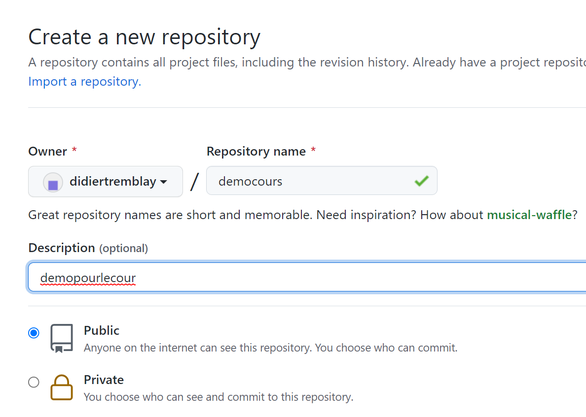
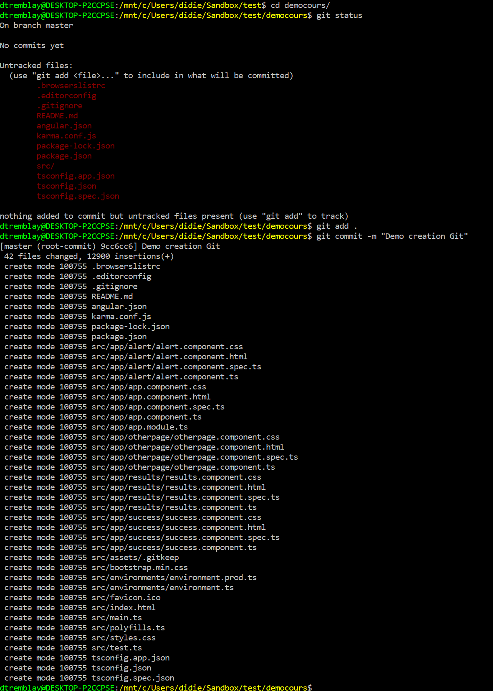

# Facon simple et sure pour créer un repository

Il y a plusieurs façon de créer un répository. Mais voici un processus simple qui fonctionne bien.

1 Créer le répository dans votre github en utilisant l'interface

2 Remplir pour nommer votre répo

3 Récupéré le URL pour votre nouveau projet

4 Utilisé Git pour prendre une copie de votre projet (vide)

5 Copier/créer le contenu pour votre projet

6 Utilisez `git add` et `git commit` pour ajouter vos fichiers dans votre projet

7 Pousse votre contenu sur le serveur avec `git push`

8 Recharge votre github et vous devriez pouvoir voir vos fichiers

