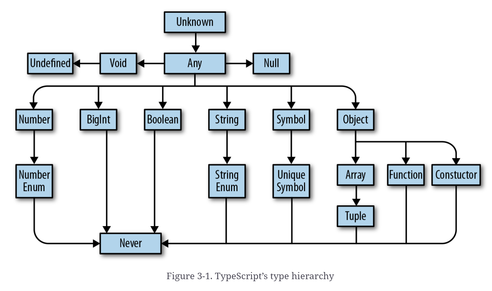
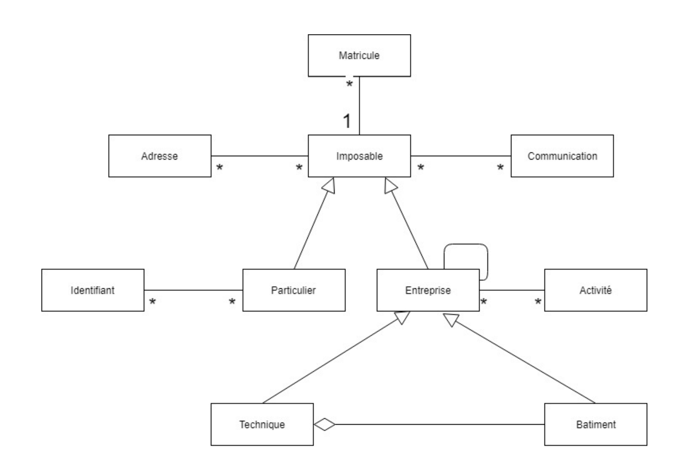
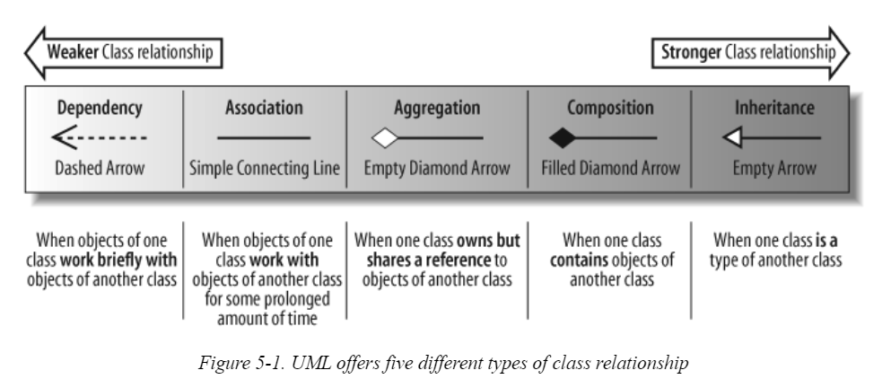
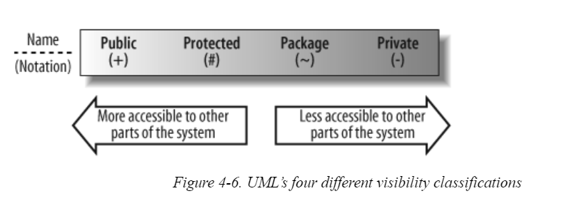
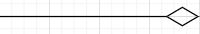
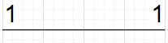
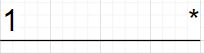
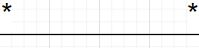

# TypeScript en quelques mots
>Le langage de programmation TypeScript [(Site web officiel)](http://www.typescriptlang.org) a été créé par Microsoft et a ensuite été open source sous la licence Apache 2.0. Le code source du langage est disponible sur GitHub à l'adresse [(GitHub TypeScript)](https://github.com/Microsoft/TypeScript). 

>Bon résumé des elements: [https://rmolinamir.github.io/typescript-cheatsheet/]

🛑 C'est une revu de typescript mais plusieurs elements ne seront pas couvert durant le cour

>La première chose à réaliser est que TypeScript se compile en JavaScript. Cela signifie que la sortie du compilateur TypeScript peut s'exécuter partout où le code JavaScript peut s'exécuter, ce qui signifie en fait, de nos jours, pratiquement partout, puisque JavaScript peut s'exécuter dans ce qui suit :
* Web browser
* Backend (exemple with Node.js)
* Desktop (exemple  with Electron)
* Mobile, avec des Frameworks comme React Native, NativeScript, Ionic, et autres.
* Le Cloud, avec des plateformes comme as Azure, Google Cloud Functions, etFirebase

> TypeScript est compilé et n'est pas interprété comme JavaScript. 
>En fait, les gens parlent souvent de **Transpilation **plutôt que de **Compilation **dans le cas de TypeScript, car le compilateur TypeScript effectue en fait une transformation source-source.

> Le deuxième point clé est que TypeScript est un sur-ensemble de JavaScript, 

> Cela signifie que tout code JavaScript valide est également un code TypeScript valide. C'est génial car cela signifie qu'il est très facile d'introduire TypeScript dans une base de code JavaScript existante. 

> Un troisième point à retenir est que TypeScript est (facultativement) typé. Si vous êtes familier avec JavaScript, vous savez probablement qu'il s'agit d'un langage dynamiquement et faiblement typé. Comme tout code JavaScript est également un code TypeScript valide, cela signifie également que vous pouvez déclarer des variables sans spécifier leur type et leur attribuer ultérieurement différents types (par exemple, des nombres, des chaînes, etc.).

Bien que la définition de types soit facultative par défaut dans TypeScript, cela ne signifie pas que vous devez éviter de définir des types. 

TypeScript vous permet de spécifier clairement le type de vos variables et fonctions. En outre, il propose également une inférence de type très puissante, une prise en charge des classes, des génériques, des énumérations, et bien d'autres choses intéressantes

***
#### 🌼 Comment TypeScript peut-il aider ?

#### 1. JavaScript amélioré
> Avant tout, TypeScript ne vise pas à remplacer JavaScript; au lieu de cela, il vise à améliorer la vie des développeurs en fournissant un langage plus puissant qui génère un code JavaScript propre et simple. D'une certaine manière, vous pourriez considérer TypeScript comme un vérificateur de qualité de code pour JavaScript.

#### 2. Le futur JavaScript aujourd'hui
> Un deuxième grand avantage est que TypeScript vous permet d'utiliser les dernières fonctionnalités d'ECMAScript dès maintenant, que vous cibliez la dernière version de Node.js . C'est génial car cela signifie que vous n'avez pas besoin d'attendre que tout soit pris en charge dans l'environnement cible.

> Vous pouvez très facilement configurer le compilateur TypeScript pour générer du code compatible ES3, ES5, ES2015, ES2016, ES2017, ES2018, ES2019 ou ESNext.

> Pour rendre cela plus clair, prenons un exemple. Dans TypeScript, vous pouvez créer des classes tout en transpilant votre code en code compatible ES3, même si les classes n'ont été introduites que dans ES2015. Le compilateur TypeScript effectue uniquement des transformations pour utiliser des constructions de langage qui existaient dans cette version d'ECMAScript. Lorsque TypeScript fait cela, nous parlons souvent d'émission de bas niveau. Il existe de nombreuses fonctionnalités des versions les plus récentes d'ECMAScript que vous pouvez utiliser avec TypeScript tout en ciblant ES5.

#### 3. Typage statique
> L'une des meilleures fonctionnalités de TypeScript est son système de type puissant ajouté au-dessus de JavaScript. Cela seul devrait plaire à tout développeur habitué à travailler avec des langages fortement typés, et donc habitué à bénéficier d'un excellent support IDE.

> Lorsque vous développez à l'aide de C # ou Java avec un éditeur / IDE solide, vous bénéficiez gratuitement de l'autocomplétion puissante, de la prise en charge de la refactorisation , de l'accès à la documentation, des conseils contextuels, des avertissements et des erreurs. TypeScript offre la même expérience de développeur pour l'écosystème JavaScript et permet aux développeurs de bénéficier d'un environnement de développement hautement productif. 
>C'est idéal pour tous les développeurs, pas seulement pour les grandes équipes.

> En termes simples, TypeScript vous aidera certainement à découvrir les bogues plus tôt et vous aidera à mieux organiser et structurer votre code, que vous travailliez sur une petite application ou un grand projet.

#### 4. Les développeurs  Java se sentiront chez eux
> TypeScript semblera naturel pour tout développeur Java car il prend en charge de nombreux concepts avec lesquels les développeurs avec cette expérience devraient être familiarisés.

> TypeScript prend en charge les concepts de programmation orientée objet (POO) via les classes, l'héritage, les constructeurs, les accesseurs de propriété, les méthodes et les interfaces. Il prend également en charge les énumérations, les génériques, les itérateurs, les générateurs, les modules, les décorateurs (également appelés annotations) et bien d'autres.

> Si vous ne considérez que les fonctionnalités de POO et de modularité de TypeScript, vous pouvez facilement comprendre que cela simplifie beaucoup la structure et l'organisation de votre base de code tout en définissant votre modèle de domaine à l'aide de concepts familiers.

> De plus, comme il s'agit d'un sur-ensemble de JavaScript, il prend également en charge la programmation fonctionnelle.

> Avoir une expérience préalable avec tous ces concepts vous donne certainement un avantage pour vous familiariser rapidement avec TypeScript.

🌼 Déclaration des variables
> Le mot clé **var **de JavaScript pour déclarer notre variable.

### Avant de coder quoi que ce soit d'autre ensemble, vous devez vraiment savoir que **var** est un mot-clé que vous devez oublier et ne plus jamais utiliser.

🛑 Pourquoi? 

>Le problème est que **var** ne prend pas en charge la portée du bloc. Au lieu de cela, les variables déclarées avec **var**ont une portée fonctionnelle et toutes les déclarations de variables dans un bloc seront hissées vers la fonction environnante.

>Le **Hoisting** (le hissage)est un concept JavaScript étrange. En JavaScript, les déclarations de variables (et les déclarations en général) sont traitées en premier, avant toute autre exécution. Cela signifie que déclarer une variable n'importe où est exactement la même chose que la déclarer en haut. Cela signifie également qu'une variable peut être utilisée avant d'être déclarée, ce qui est pour le moins contre-intuitif.

```Javascript
var a = 12;
var result = a + b;
var b = 30;
console.log("Result: ",result);
```

>Le code précédent est un code JavaScript parfaitement valide (mais n'est certainement pas recommandé).

Autre example de problème avec var

```Javascript
// var let const

function f(shouldInitialize: Boolean) {
    //let x: number;

    if (shouldInitialize) {
        //var x=10;
        let x=10;
    }

    return x;
}

console.log(f(true));
console.log(f(false));
```

>Jusqu'à ES5, **var** était le seul moyen de déclarer des variables, mais cela a changé avec ES2015, qui a introduit deux nouveaux mots-clés: **let** et **const**. Ces deux mots clés prennent en charge la portée de bloc.

> Le mot clé let est l'alternative la plus sûre à var, tandis que const vous permet de définir des constantes.

> Nous mettons des constantes entre guillemets car le mot-clé const ne rend pas les objets immuables; il garantit seulement que la variable ne peut pas être réaffectée, mais le contenu de l'objet vers lequel elle pointe peut être modifié.

> Voici l'ordre de préférence recommandé : **const> let> var**.

***

Code| Définition| Année |
--- | --- | --- |
**ES5** | *ES5 est un raccourci pour ECMAScript 5* | 2009 |
**ES2015** | *Spécification 2015 pour le langage ECMAScript (sixième édition)* | 2015|

> ECMAScript est un langage de script qui forme la base de JavaScript. ECMAScript est standardisé par l'organisation ECMA International grâce aux spécifications ECMA-262 et ECMA-402.
***


###  Exercise : [compilateur](https://github.com/420-345-AL/materiel_du_cours/tree/master/typescript/exercises/compilateur)

```Javascript
function bonjour(personne) {
    return "Bonjour " + personne;
}

var utilisateur = "Didier";
console.log(bonjour(utilisateur));

function bonjour2(personne: string) {
    return "Bonjour " + personne;
}

console.log(bonjour2(utilisateur));

var utilisateur2 = 42;

console.log(bonjour(utilisateur2));
console.log(bonjour2(utilisateur2));
// Peut etre contourne..
```

#### 🌼 Types de base de TypeScript

[https://www.typescriptlang.org/docs/handbook/2/everyday-types.html]

> Avant de continuer, voyons quels types de base sont pris en charge par TypeScript:

>boolean: true or false.
>number: Valeurs à virgule flottante. Ceux-ci peuvent être exprimés sous forme hexadécimale, décimale, binaire et octale.
>string: peuvent être délimités par des guillemets simples ('), des guillemets doubles (") ou des graduations inverses (`) pour définir les littéraux de modèle (template String).

Voici quelques exemples de nombres:
>* let decimal: number = 42
>* let hexadecimal: number = 0x42
>* let binary: number = 0b101010
>* let octal: number = 0o52

Voici quelques exemples de String :
* let hello: string = 'Hello'
* let world: string = "World"
* let cool: string = `${hello} ${world}!`



# Example of type

```Javascript
// number
// string
// Boolean
// null, undefined
// any
// void

var x = 1000;
// Inferred!

var x2 = x;
var y: string;
var y2 = 'string';

y = x;
var x2 = "Un mot";

var z: Boolean;
var z1 = false;

var aaa: any = x+y+z1;
```

### Exercise [Types](https://github.com/420-345-AL/materiel_du_cours/tree/master/typescript/exercises/Types)
### Exercise [Typeof Type](https://github.com/420-345-AL/materiel_du_cours/tree/master/typescript/exercises/Typeof%20Type)
### Exercise [Erreurs](https://github.com/420-345-AL/materiel_du_cours/tree/master/typescript/exercises/Erreurs)
### 

# Types

## Any

N'importe qu'elle type est possible. À utiliser uniquement si impossible de faire autrement. Est-ce qu'un union de type est possible pour régler le problème?

```Javascript
let a: any = 666            // any
let b: any = ['danger']     // any
let c = a + b               // any
```

## Unknown


```Javascript
let a: unknown = 30         // unknown
let b = a === 123           // boolean
let c = a + 10              // Error TS2571: Object is of type 'unknown'.
if (typeof a === 'number') {
  let d = a + 10            // number
                            // Pourquoi?!
}
```

## boolean

```Javascript
let a = true                // boolean
var b = false               // boolean
const c = true              // true
let d: boolean = true       // boolean
let e: true = true          // true
let f: true = false         // Error TS2322: Type 'false' is not assignable
                            // to type 'true'.
```

## number

Limit a une valeur maximal de 2^53

```Javascript
let a = 1234                // number
var b = Infinity * 0.10     // number
const c = 5678              // 5678
let d = a < b               // boolean
let e: number = 100         // number
let f: 26.218 = 26.218      // 26.218
let g: 26.218 = 10          // Error TS2322: Type '10' is not assignable
                            // to type '26.218'.
```

## bigint

Bigint n'est pas toujours supporté par certain navigateur.

```Javascript
let a = 1234n               // bigint
const b = 5678n             // 5678n
var c = a + b               // bigint
let d = a < 1235            // boolean
let e = 88.5n               // Error TS1353: A bigint literal must be an integer.
let f: bigint = 100n        // bigint
let g: 100n = 100n          // 100n
let h: bigint = 100         // Error TS2322: Type '100' is not assignable
                            // to type 'bigint'.
```

## string

```Javascript
let a = 'hello'             // string
var b = 'billy'             // string
const c = '!'               // '!'
let d = a + ' ' + b + c     // string
let e: string = 'zoom'      // string
let f: 'john' = 'john'      // 'john'
let g: 'john' = 'zoe'       // Error TS2322: Type "zoe" is not assignable
                            // to type "john".
```

## Symbol

```Javascript
let a = Symbol('a')         // symbol
let b: symbol = Symbol('b') // symbol
var c = a === b             // boolean
let d = a + 'x'             // Error TS2469: The '+' operator cannot be applied
                            // to type 'symbol'.
```

## Objects

```Javascript
let a = {
  b: 'x'
}            // {b: string}
a.b          // string

let b = {
  c: {
    d: 'f'
  }
}            // {c: {d: string}}

let c: {
  firstName: string
  lastName: string
} = {
  firstName: 'john',
  lastName: 'barrowman'
}

class Person {
  constructor(
    public firstName: string,   // public is shorthand for
                                // this.firstName = firstName
    public lastName: string
  ) {}
}
c = new Person('matt', 'smith') // OK
```

## null

Permet d'indiquer l'absence de valeur

```Javascript
// (a) A function that returns a number or null
function a(x: number) {
  if (x < 10) {
    return x
  }
  return null
}
```

## Undefined

Permet d'indiqué que l'élément n'est pas défini. null et undefined sont pareils la différence vient du contexte.

```Javascript
// (b) A function that returns undefined
function fb() {
  return undefined
}

let a=null;
let b=undefined;
let c: null=undefined;
let d: undefined=null;

console.log('a===b', a===b);  // false
console.log('a===c', a===c);  // false
console.log('a===d', a===d);  // true

console.log('a==b', a==b);    // true
console.log('a==c', a==c);    // true
console.log('a==d', a==d);    // true
```

## void

Une fonction qui ne doit pas retouner d'information

```Javascript
// (c) A function that returns void
let res: number;

function c(): void {
    let a = 2 + 2
    let b = a * a

    // return a;   // error TS2322: Type 'number' is not assignable to type 'void'.
  }

c();
res = c(); // error TS2322: Type 'void' is not assignable to type 'number'.

console.log(res);
```

## never

Indique une fonction qui ne termine jamais.

```Javascript
// (d) A function that returns never
function d() {
  throw TypeError('I always error')
}

// (e) Another function that returns never
function e() {
  while (true) {
    doSomething()
  }
}
```

# Array

Permet de créer un vecteur d'élément du type specifié 

```Javascript
let a = [1, 2, 3]           // number[]
var b = ['a', 'b']          // string[]
let c: string[] = ['a']     // string[]
let d = [1, 'a']            // (string | number)[]
const e = [2, 'b']          // (string | number)[]

let f = ['red']
f.push('blue')
f.push(true)                // Error TS2345: Argument of type 'true' is not
                            // assignable to parameter of type 'string'.

let g = []                  // any[]
g.push(1)                   // number[]
g.push('red')               // (string | number)[]

let h: number[] = []        // number[]
h.push(1)                   // number[]
h.push('red')               // Error TS2345: Argument of type '"red"' is not
                            // assignable to parameter of type 'number'.
```

# Tupple

Vecteur qui contient un nombre spécifique d'éléments

```Javascript
let a: [number] = [1]

// A tuple of [first name, last name, birth year]
let b: [string, string, number] = ['malcolm', 'gladwell', 1963]

b = ['queen', 'elizabeth', 'ii', 1926]  // Error TS2322: Type 'string' is not
                                        // assignable to type 'number'.
```

## Read Only

Array et Tupple peuve être typé comme readonly.

```Javascript
let as: readonly number[] = [1, 2, 3]     // readonly number[]
let bs: readonly number[] = as.concat(4)  // readonly number[]
let three = bs[2]                         // number
as[4] = 5            // Error TS2542: Index signature in type
                     // 'readonly number[]' only permits reading.
as.push(6)           // Error TS2339: Property 'push' does not
                     // exist on type 'readonly number[]'.
```

# Alias

```Javascript
type Age = number

type Person = {
  name: string
  age: Age
}
```

# Union

Permet de combiner des types.

```Javascript
let x_union: string | Boolean;

x_union = "chat";
x_union = false;
x_union = 123;


let names: string | string[];

names = "Didier";
names = ["Didier", "Francis", "Francoise", "Kassandra"];

type Cat = {name: string, purrs: boolean}
type Dog = {name: string, barks: boolean, wags: boolean}

type CatOrDogOrBoth = Cat | Dog;
type CatAndDog = Cat & Dog;
```

# Enum

```Javascript
const enum Langue {
    Francais,
    Anglais,
    Latin
    // Other definition
    
}

let a = Langue.Latin
console.log(a);

let b = Langue.Typescript

let c = Langue[2]
```

```Javascript
enum Language {
  English = 0,
  Spanish = 1
}

enum Language {
  Russian = 2
}
```

```Javascript
enum Language {
  English = 100,
  Spanish = 200 + 300,
  Russian                 // TypeScript infers 501 (the next number after 500)
}
```

```Javascript
enum Color {
  Red = '#c10000',
  Blue = '#007ac1',
  Pink = 0xc10050,        // A hexadecimal literal
  White = 255             // A decimal literal
}

let red = Color.Red       // Color
let pink = Color.Pink     // Color

let a = Color.Red         // Color
let b = Color.Green       // Error TS2339: Property 'Green' does not exist
                          // on type 'typeof Color'.
let c = Color[0]          // string
let d = Color[6]          // string (!!!)
```

### Execise [Enums](https://github.com/420-345-AL/materiel_du_cours/tree/master/typescript/exercises/Enum)

# Boucle

```Javascript
{
    for (let i=0; i<10; i++) {
        console.log(i);
    }
}

{
    let i=0;
    while (i<10) {
        console.log(i++);
    }
}

{
    let i: number=0;
    do {
        console.log(i++)
    } while(i<10)
}

let vecteur: number[] = [6,5,4,3,2,1];
for (let item of vecteur) {
    console.log(item);
}
```

# Fonction et types

```Javascript
function myFunction(param: number, param2: number, param3: number = 0): void {


    // return 42;
}

// any
// int
// void

function multiArgs(...args:any[]) {
    for (let arg of args) {
        console.log(typeof arg)
    }
}

multiArgs(4,2,4,"Salut", null, true, ()=>1+1, [4,5]);

var obj={
    asyncmethod(param1, param2, callback) {
        /// some code
        // Using this

        callback(...);
    }
}

obj.asyncmethod(1,2,function(err, result) {
    // code here
    // This will possibly clash with this
})

// should be

obj.asyncmethod(1,2,(err, result)=>{
    // code here
});

function abc(params1) {
    return def;
}

// same as

(params1) => {
    return def;
}

// Same as

(param1) => def;

// Same as

param1 => def;


// Template

function filtre<T>(vecteur:T[], filtre:T): T[] {
  let result = []
  for (let i = 0; i < vecteur.length; i++) {
        let item = vecteur[i]
        if (filtre == item) {
        result.push(item)
    }
  }
  return result;
}
```

### Exercise : [Creer une fonction](https://github.com/420-345-AL/materiel_du_cours/tree/master/typescript/exercises/Creer%20un%20fonction)
### Exercise : [Calculatrice](https://github.com/420-345-AL/materiel_du_cours/tree/master/typescript/exercises/Calculatrice)
### Exercise : [parametres](https://github.com/420-345-AL/materiel_du_cours/tree/master/typescript/exercises/parametres)

# Chaines et vecteurs

```Javascript
// String and array

let abcd: string = 'abcdef';
let defg: string = "f:a:s:d:f:g"; // convention est single quote mais les deux fonctionnes.

let composite: string = `Ceci est ${abcd} et ${defg}`
// Look at the compiled code.

let vecteur1 = defg.split(':');
console.log(vecteur1);

console.log(vecteur1.slice(2,4));

// unshift
// pop
// shift
// push

let vecteur2: Number[] = [1, 2, 3, 4, 5, 6];

vecteur2.push("Salut"); // Detecte par Typescript
```

# Rest / Spread Operator

Permet de referencer un vecteur ou une classe.

```Javascript
const newItem = 3;

const oldArray = [1, 2];

const newArray = [...oldArray, newItem]; // Maintenant [1, 2, 3]
```

Fonctionne aussi pour une classe

```Javascript
const oldPerson = { name : 'Didier' };
const newPerson = { ...oldPerson, age : 42 };
```

Le spread équivaut a retourner tous les élément du vecteur ou de la classe.

# Interfaces et Objets

[https://www.typescriptlang.org/docs/handbook/2/classes.html]

```Javascript
var personne = {
    prenom: 'Didier',
    nom_de_famille: 'Tremblay',
    age: 42,
    nom_complet: function () {
        return `${this.prenom} ${this.nom_de_famille}`;
    }
}

console.log(personne.nom_complet());

interface IPerson {
    last_name: string;
    first_name: string;
    age: number;
}

let personne2: IPerson = {
    // Will be complaining if missing
    first_name: 'Didier',
    last_name: 'Tremblay',
    age: 42
    // will be complaining if too many
}

/* Won't work
personne2.first_name = 123 
personne2.age = "423"
*/
personne2.age += 10;

interface IMarie extends IPerson {
   epouse: IPerson;
   date_de_marriage: string;
}

let personne3: IPerson = {
    first_name: 'Francoise',
    last_name: 'Trepanier',
    age: 25
}

let personne4: IMarie = {
    first_name: "Didier",
    last_name: 'Tremblay',
    age: 37,
    epouse: personne3,
    date_de_marriage: '2017-09-13'
}

interface IInterets {
    hobby1: string,
    hobby2: string,
    hobby3: string
}

// Interface multiple
interface IPersoneMarieAvecInterets extends IMarie, IInterets {
    // C'est possible qu'il n'y ait rien a mettre
}

let persone4: IPersoneMarieAvecInterets = {
    first_name: "Didier",
    last_name: 'Tremblay',
    age: 37,
    epouse: personne3,
    date_de_marriage: '2017-09-13',
    hobby1: 'Dungeon et Dragon',
    hobby2: 'Astronomy',
    hobby3: 'Cuisine'
}

interface IDisplayObject {
    display(): void;
    displayString(): string;
    
}

class Employee implements IDisplayObject {
    prenom: string;
    nom: string;
    age: number

    _nas: number = 1234;
    private _assurance_maladie: string = "TREDxxxxx";
    protected _numero_employe: number = 54321;

    constructor(nom:string, pre:string, age:number) {
        // THIS <--- is important here.
        this.prenom = pre;
        this.age = age;
        this.nom = nom;
    }

    display(): void {
        console.log(this);
    }

    displayString(): string {
        return JSON.stringify(this);
    }

    protected displayProtected(): void {
        // Peut etre par une method de l'object
        console.log('This is Protected');
    }

    private displayPrivate(): void {
        // Peut etre appeler par cette classe uniquement.
        console.log('This is private');
    }

    displayPrivateAndProtectedOriginal(): void {
        console.log("De l'employee");
        this.displayPrivate();
        this.displayProtected(); 
    }
}

let employee = new Employee('Tremblay', 'Didier', 42);

employee.prenom = "Didier";
employee.nom = "Tremblay";
employee.age = 42;

employee._nas = 1234;
/*
employee._assurance_maladie = 'fgdjg';
employee._numero_employe = 12345;
*/
console.log(employee);
console.log(JSON.stringify(employee));

employee.display();

console.log(employee.displayString());

class Retraite extends Employee {
    date_de_retraite: string;

    constructor(nom:string, pre:string, age:number, date_retraite: string) {
        super(nom, pre, age)
        this.date_de_retraite = date_retraite;

    }

    displayPrivateAndProtected(): void {
        // this.displayPrivate();  // <-- pas possible.
        console.log("Du retraite");
        this.displayProtected(); 

    }
}

let retraite = new Retraite('Tremblay', 'Robert', 99, '1999-01-01');

retraite.prenom = 'Robert';
retraite.nom = 'Tremblay'
retraite.age = 99;
retraite.date_de_retraite = '2000-01-01';

console.log('Ceci doit etre utilise en test uniquement: ' + retraite['_assurance_maladie']);
console.log('Ceci doit etre utilise en test uniquement: ' + retraite['_numero_employe']);

retraite.display();
// retraite.displayPrivate();
// retraite.displayProtected();
retraite.displayPrivateAndProtectedOriginal();
retraite.displayPrivateAndProtected();
```


#### 🌼 Classes, interfaces et héritage
🌿 Anatomie d'une classe
> Les attributs d'une classe viennent en premier, puis un constructeur et plusieurs méthodes et accesseurs de propriété suivent. 
> Tous les membres et méthodes sont annotés avec un type, à l'exception du constructeur. L'extrait de code suivant illustre à quoi pourrait ressembler une classe:

```typescript
class Car {
    private distance: number = 0;
    private color: string;
    
    constructor(private isHybrid: boolean, color: string ='red') {
        this.color = color;
    }
    
    getConsommationEssence(): string {
        return this.isHybrid ? 'Faible Conso' : 'Forte Conso!';
    }
    
    drive(trajet: number): void {
        this.distance += trajet;
    }
    
    static immatriculation(): string {
        return 'ABCD-1234!';
    }
    
   get distance(): number {
        return this.distance;
    }
}
```

🌿  Constructeur : 
> Le constructeur s'exécute immédiatement lorsque nous créons une instance de la classe. Habituellement, nous voulons initialiser les membres de la classe ici, avec les données fournies dans la signature du constructeur. Nous pouvons également exploiter la signature du constructeur elle-même pour déclarer les membres de la classe, comme nous l'avons fait avec la propriété isHybrid. Pour ce faire, nous devons préfixer le paramètre constructeur avec un modificateur d'accès tel que privé ou public. Comme nous l'avons vu lors de l'analyse des fonctions dans les sections précédentes, nous pouvons définir des paramètres repos, optionnels ou par défaut, comme illustré dans l'exemple précédent avec l'argument color, qui revient au rouge lorsqu'il n'est pas explicitement défini.

***
#### 🌼 Les Getters et Setters
> Les Getters et les Setters sont utilisés pour protéger vos données, en particulier lors de la création de classes.

> Pour chaque variable d'instance, une méthode getter renvoie sa valeur tandis qu'une méthode setter définit ou met à jour sa valeur. Compte tenu de cela, les getters et les setters sont également appelés accesseurs et mutateurs, respectivement.

> Par convention, les getters commencent par le mot "get" et les setters par le mot "set", suivi d'un nom de variable. Dans les deux cas, la première lettre du nom de la variable est en majuscule
***

```Javascript
class Person {
  private _age!: number;
  private _firstName!: string;
  private _lastName!: string;


  public get age(): number {
      return this._age;
  }

  public set age(theAge: number) {
      if (theAge <= 0 || theAge >= 200) {
          throw new Error('The age is invalid');
      }
      this._age = theAge;
  }

  public getFullName(): string {
      return `${this._firstName} ${this._lastName}`;
  }
}

let my_person = new Person()

my_person.age = 0; // Will fail with exception
```

#### 🌼 Les interfaces
> Au fur et à mesure que les applications évoluent et que de plus en plus de classes et de constructions sont créées, nous devons trouver des moyens d'assurer la cohérence et la conformité des règles dans notre code. L'un des meilleurs moyens de gérer la cohérence et la validation des types consiste à créer des interfaces. 

> En un mot, une interface est un modèle du code qui définit le schéma d'un champ particulier. Tous les artefacts (classes, signatures de fonction, etc.) qui implémentent ces interfaces doivent être conformes à ce schéma. Cela devient utile lorsque nous voulons appliquer un typage strict sur les classes générées par des usines, ou lorsque nous définissons des signatures de fonction pour nous assurer qu'une propriété typée particulière est trouvée dans la charge utile.

> Dans le code suivant, nous définissons l'interface Voiture. Ce n'est pas une classe, mais un schéma contractuel auquel toute classe qui l'implémente doit se conformer:

```typescript
interface Voiture{
    moteur: string;
}

Toute classe implémentant cette interface doit contenir un attribut nommé moteur, qui doit être saisi sous forme de chaîne:

class Toyota implements Voiture{
    moteur: string;
}
```
*** 

### Exercise: [Interface](https://github.com/420-345-AL/materiel_du_cours/tree/master/typescript/exercises/Interface)

# Decorateur

Decorateur permet de changer un élément en modifiant ses paramètres d'entrées et ou de sortie. Il est possible de créer des décorateurs pour une Classe, propriété, méthodes ou paramêtres.

## Class decorator

Augmente une classe ou effectue un operation sur ses attributs. Le décorateur de classe est éxécuté avant que la classe soit matérialisée. Le décorateur est une fonction qui recoit un pointeur sur le constructure de la classe.

```Javascript
declare type ClassDecorator = <TFunction extends Function>(Target:TFunction) => TFunction | void;
```

Example:

```Javascript
function Banana(target: Function): void {
    target.prototype.banana = function(): void {
        console.log('We have bananas!');
    }
}

@Banana
class FruitBasket {
    constructor() {}
}

const basket = new FruitBasket();
basket.banana();
```

Peut aussi avoir des paramètres:

```Javascript
function Banana(message: string) {
    return function(target: Function) {
        target.prototype.banana = function(): void {
            console.log(message);
        }
    }
}

@Banana('Bananas are yellow!')
class FruitBasket {
    constructor() {}
}
```

## Property Decorator

```Javascript
function Jedi(target: Object, key: string) {
    let propertyValue: string = this[key];
    if (delete this[key]) {
        Object.defineProperty(target, key, {
            get: function() {
                return propertyValue;
            },
            set: function(newValue){
                propertyValue = newValue;
                console.log(`${propertyValue} is a Jedi`);
            }
        });
    }
}

class Character {
    @Jedi
    name: string;
}

const character = new Character();
character.name = 'Luke';
```

Example avec Paramètre

```Javascript
function NameChanger(callbackObject: any): Function {
    return function(target: Object, key: string): void {
        let propertyValue: string = this[key];
        if (delete this[key]) {
            Object.defineProperty(target, key, {
                get: function() {
                    return propertyValue;
                },
                set: function(newValue) {
                    propertyValue = newValue;
                    callbackObject.changeName.call(this, propertyValue);
                }
            });
        }
    }
}

class Character {
    @NameChanger ({
        changeName: function(newValue: string): void {
            console.log(`You are now known as ${newValue}`);
        }
    })
    name: string;
}

var character = new Character();
character.name = 'Anakin';
```

## Method decorators

```Javascript
function Log(){
    return function(target, propertyKey: string, descriptor: PropertyDescriptor) {
        const oldMethod = descriptor.value;
        descriptor.value = function newFunc( ...args:any[]){
            let result = oldMethod.apply(this, args);
            console.log(`${propertyKey} is called with ${args.join(',')} and result ${result}`);
            return result;
        }
    }
}

class Hero {
    @Log()
    attack(...args:[]) { return args.join(); }
}

const hero = new Hero();
hero.attack();
```

NOTE: [Apply](https://developer.mozilla.org/fr/docs/Web/JavaScript/Reference/Global_Objects/Function/apply)

## Parameter decorator

Ne doit pas modifier le parametre. Plus utilise dans des scenarios de retourner de l'information.

```Javascript
function Log(target: Function, key: string, parameterIndex: number) {
    const functionLogged = key || target.prototype.constructor.name;
    console.log(`The parameter in position ${parameterIndex} at ${functionLogged} has been decorated`);
}

class Greeter {
    greeting: string;
    
    constructor (@Log phrase: string) {
        this.greeting = phrase;
    }
}
```

### Exercise: [Recettes](https://github.com/420-345-AL/materiel_du_cours/tree/master/typescript/exercises/Recettes)

> *Important* pour cette execise vous devez sousmettre votre travail dans le repertoire GIT (le répertoire `pratique-pour-tp` pas le materiel de cours)

# Export et Module

Export permet de rendre une class visible pour un autre fichier

```Javascript
export class MyService {
    getData() {}
}

export const PI = 3.14;
```

Import permet d'inclure un fichier pour utiliser un service qui fut exporté

```Javascript
import { MyService, PI } from './my-service'; 
```

# UML

## planUML

### Exercise
> Recréez ce diagram en utilisant PlanUML. Poussez votre réalisation dans le project `pratrique-pour-tp/exercises/UMLetClasses` . Ensuite creer un fichier typescript qui représente les différentes relations. Soumettre le fichier dans GIT lorsque terminé. 



Dans ce diagramme la référence circulaire sur Enterprise fut utilisé pour denonter un Singleton. Dans plantUML un singleton utilise une approche différente.

### PlantUML
[PlanUML](https://plantuml.com/fr/class-diagram)

## Relations vs Typescript



### Composition

Une classe qui contient des instances d'une autre classe.

```Javascript
class Directory {
  files: File[];
  directories: Directory[];

  constructor(files: File[], directories: Directory[]) {
    this.files = files;
    this.directories = directories;
  }

  addFile(file: File): void {
      this.files.push(file);
  }

  addDir(directory: Directory): void {
    this.directories.push(directory);
  }
}
```

### Association

Object qui contient une référence envers un autre object.

```Javascript
models for Blog and Author:
class Blog implements Identifiable<string> {
    id: string;
    authorId: string;
    constructor(id: string, authorId: string) {
        this.id = id;
        this.authorId = authorId;
    }
}

class Author {}
```

### Aggregation

Similaire a une association ou les deux entités peux exister indépendament de chacune.

```Javascript
class QueryBuilder {}

class EmptyQueryBuilder extends QueryBuilder {}

interface SearchParams {
  qb?: QueryBuilder;
  path: string;
}

class SearchService {
  queryBuilder?: QueryBuilder;
  path: string;
  constructor({ qb = EmptyQueryBuilder, path }:
    SearchParams) {
    this.queryBuilder = qb;
    this.path = path;
  }
}
```

### Héritage (extends)

```Javascript
class BaseClient {}
class UsersApiClient extends BaseClient {}  
```

### Private, protected, public



```Javascript
class SSHUser {
  private privateKey: string;
  public publicKey: string;
  constructor(prvKey: string, pubKey: string) {
    this.privateKey = prvKey;
    this.publicKey = pubKey;
  }

  public getBase64(): string {
    return Buffer.from(this.publicKey).toString
      ("base64");
  }
}
```


🌼 Tableau de conversion (passage) du diagramme au code Typescript

| Formes       | Définition          | Code Typescript  | Remarques |
|-------------| ------------- | ----- | ----- |
|A   B   | Héritage | class A **extends** B |  B est la classe Parent |
|A   B   | Implémentation| class A **implements** B | B est une interface  |
|  | | |
|A   B   | Association| class A **utilise** B ou l'inverse | Il y a 3 types d'associations|
|  | | |
|A   B   | Composition| class A **est un attribut** de class B et doit être instancié dans tout constructeur de B | Aucune remarque |
|A   B   | Agrégation| class A **est un attribut** de class B et il n'y a pas besoin de l'instancier dans tout constructeur de B | Aucune remarque |
|  | | |

🌼 Les différents types d'associations :

| Formes      | Définition          | Code Typescript  | Remarques |
|-------------| ------------- | ----- | ----- |
|A   B   | **OneToOne** | class A est **en relation 1 à 1** avec B |  On a le choix dans le code [Soit A devient un attribut dans B ou l'inverse]  | 
|A   B   | **OneToMany** | class A est **en relation 1 à plusieurs** avec B | Dans le code la classe A aura un attribut **DE TYPE TABLEAU de B** |
|A   B   | **ManyToMany** | class A est **en relation plusieurs à plusieurs** avec B | Dans le code, on crée une nouvelle classe AB qui aura au moins 2 attributs **[un de l'objet A et un de l'objet B]** |
|  | | |

```Typescript
> Une astuce pour valider le passage du diagramme de classes vers le code Typescript.
> Il faut s'assurer que le nombre de classes Typescript soit **SUPÉRIEUR OU ÉGAL** au nombre de classes du diagramme.
   > Quand est-ce qu'il est supérieur ? 
   > Le seul cas est lors de présence de relation ManyToMany (qui implique la création d'une classe associative).
```


```Javascript

```

```Javascript

```


### Abstract Class

```Javascript
abstract class Base {
  abstract getName(): string;
 
  printName() {
    console.log("Hello, " + this.getName());
  }
}
 
const b = new Base();
// Cannot create an instance of an abstract class.
```

### Singleton

```Javascript
/**
 * The Singleton class defines the `getInstance` method that lets clients access
 * the unique singleton instance.
 */
class Singleton {
    private static instance: Singleton;

    /**
     * The Singleton's constructor should always be private to prevent direct
     * construction calls with the `new` operator.
     */
    private constructor() { }

    /**
     * The static method that controls the access to the singleton instance.
     *
     * This implementation let you subclass the Singleton class while keeping
     * just one instance of each subclass around.
     */
    public static getInstance(): Singleton {
        if (!Singleton.instance) {
            Singleton.instance = new Singleton();
        }

        return Singleton.instance;
    }

    /**
     * Finally, any singleton should define some business logic, which can be
     * executed on its instance.
     */
    public someBusinessLogic() {
        // ...
    }
}

/**
 * The client code.
 */
function clientCode() {
    const s1 = Singleton.getInstance();
    const s2 = Singleton.getInstance();

    if (s1 === s2) {
        console.log('Singleton works, both variables contain the same instance.');
    } else {
        console.log('Singleton failed, variables contain different instances.');
    }
}

clientCode();
```

### Execise
> Dans le répertoire interfaces que vous avez créez dans un exercise précédent. Créer le UML pour les deux interfaces que vous avez réalisé


# Autre materiel a mettre en ordre

* 🍄 La différence entre var, let et const
* 🍄 Les types primitis en Typescript
* 🍄 La différence entre Object et object
***

## 🔡 Les propriétés du langage Typescript
***
###  🌿  La différence entre var, let et const

#### TypeScript a de nombreuses façons de déclarer une variable. Vous pouvez définir une variable au niveau d'une fonction à l'aide de l'un des trois mots clés suivants : 

 * 🔸  var
 * 🔸   let 
 * 🔸  const

***
### 🌼 Le mot clé **var**
La manière la plus simple de déclarer une variable consiste à utiliser le mot-clé var. C'est la déclaration la plus ancienne, mais la méthode la moins appréciée en raison de certaines bizarreries. Le principal problème avec var est qu'il est déclaré dans le contexte d'exécution, ce qui signifie dans la portée de la fonction ou dans la portée globale. Si, par accident, une valeur est affectée à une variable non explicitement déclarée avec var, alors la portée de la variable est à la portée globale. Voici un exemple:

#### En outre, vous pouvez définir une variable avec public, private ou protected au niveau de la classe.

```typescript
function f1(){
   a = 2; // Pas de "var" explicite, donc portée globale au lieu de portée de fonction
}
```

#### Une déclaration var peut être rendue plus stricte avec le mode strict de JavaScript afin que TypeScript puisse activer automatiquement chaque fichier en utilisant **alwaysStrict** dans les options de son compilateur. 
#### Sinon, vous devez vous rappeler que les variables déclarées par var sont créés avant l'exécution du code. Les variables sans le mot-clé var n'existent pas tant que le code qui les affecte n'est pas exécuté. En JavaScript, il est possible d'attribuer une variable sans déclarer, ce qui n'est pas le cas avec TypeScript.

***

### 🌼 Le mot clé **let**

#### Une déclaration **let** est basée sur la portée. Il ne peut pas être déclaré plus d'une fois par portée et ne hisse pas la variable. Cela simplifie la lisibilité du code et évite les erreurs inattendues. 
#### La déclaration avec let ne définit pas non plus de valeurs globalement. S'appuyer sur let est le moyen de déclarer une variable lorsque vous prévoyez que la variable sera définie plus d'une fois. Dans le code suivant, la variable a est définie trois fois. Le code est légal, même avec plusieurs déclarations. 
#### La raison en est que chaque déclaration, avec let, est définie dans une portée différente avec des accolades. La première portée est la portée de la fonction. 
#### La deuxième portée utilise une syntaxe inhabituelle, mais elle reflète la façon dont une fonctionnalité while, if ou autre fonctionne. La troisième portée est dans une instruction if.

```typescript
function letFunction() {
   let a: number = 1;
   { // Scope start
     let a: number = 2;
   } // Scope end
   console.log(a); // 1

   if(true){ // Scope start
     let a: number = 3;
    } // Scope end
    console.log(a); // 1
}
letFunction()
``` 

```typescript
let a:number = 2;
a = "two"; // ne compile pas
```
#### Déclarer une variable avec let dans un cas de commutateur peut être délicat. La raison en est que la portée n'est pas par cas, mais pour le commutateur qui héberge tous les cas. 

#### Cependant, il est possible de concevoir une lunette en invoquant une parenthèse bouclée à l'intérieur de chaque boîtier. Le code suivant est valide même si deux variables b sont déclarées

```typescript
function switchFunction(num: number) {
let b: string = "functionb";

   switch (num) {
       case 1:
   let b: string = "case 1";
       break;
   }
}
```
#### Cependant, l'ajout d'un cas ultérieur qui déclare également une variable b échoue la compilation :
```typescript
function switchFunction(num: number) {
  let b: string = "functionb";

  switch (num) {
    case 1:
 let b: string = "case 1";
    break;
    case 2:
let b: string = "case 2";
    break;
  }
```

***
### 🌼 Le mot clé **const**
Dans le cas où vous savez que la variable est définie une fois et ne changera pas, alors utiliser **const** est une meilleure alternative. La raison en est qu'il met en évidence pour le lecteur du code que la valeur ne peut pas être définie plus d'une fois - elle est déclarée et initialisée. TypeScript respecte **let** et **const**, et le code ne sera pas compilé si une variable est définie plus d'une fois ou si une valeur est affectée deux fois lorsque la variable est une constante.

Consigner une variable pour rester avec une seule valeur peut sembler restrictif, mais dans de nombreuses situations, c'est la bonne chose à faire. La déclaration d'une primitive avec **const** bloque l'accès à l'affectation avec le signe égal (=), ce qui signifie qu'elle ne permet pas de changer la référence de la variable. 

Cependant, vous pouvez modifier le contenu de la variable. Par exemple, un tableau de primitives peut ajouter et supprimer des valeurs du tableau, mais ne peut pas affecter une nouvelle liste de valeurs :

```typescript
const arr: number[] = [1, 2, 3];
arr.push(4);
```
TypeScript, avec l'utilisation de **let** et **const**, garantit que la valeur affectée à une variable est associée à la variable souhaitée, et toute assignation erronée provoquera le renvoi d'une erreur par le compilateur. Dans le code suivant, deux variables sont clairement définies au niveau de la portée globale, ainsi que la portée de la fonction. 

Il ne fait aucun doute qu'il s'agit de deux variables distinctes avec une collusion de valeur :
```typescript
const a = 2;
function z() {
   let a = 3;
}
```

*** 
### 🌐 Les types primitifs

Type | Primitif | Description | Exemple code
--- | --- | --- | --- |
*Number* | *number* | **Un nombre peut être un int, un float, un double, négatif, positif et même NaN** | var variablename:number;
*String* | *string* | **Le type primitif de chaîne est le même que le type primitif JavaScript et représente une séquence de caractères stockés sous forme de code Unicode UTF-16** | var variable:string; 
*Boolean* | *boolean* | **Le type primitif booléen est le même que le type primitif JavaScript et représente une valeur logique; soit vrai ou faux** | var flag:bool;
*Null* | *null* | **Le type primitif Null est le même que le type primitif JavaScript et représente un littéral nul et il n'est pas possible de référencer directement la valeur de type nul elle-même** | var q=null; 
*Undefined* | *undefined*  | **Le type Undefined est le même que le type primitif JavaScript et est le type du littéral non défini. Le type non défini est un sous-type de tous les types** | var p:number=undefined; ou var q=undefined;

***
### 🌐 La différence entre Object et object

Il existe de nombreux types d'objets dans TypeScript. Il existe **Object**, **object** , **class object** et **object literal**. 

Le type **Object ** qui commence par une majuscule représente quelque chose de très présent, un type disponible avec chaque type et objet. L'objet en majuscule comporte un ensemble commun de fonctions. Voici la liste de ses fonctions disponibles 👍 

| Exemples de code |
| ---------------- |
|toString(): string; |
| toLocaleString(): string; |
| valueOf(): Object; |
| hasOwnProperty(v: string): boolean; |
| isPrototypeOf(v: Object): boolean; |
| propertyIsEnumerable(v: string): boolean;|


Un vaste ensemble de types relève de **Object**. L'affectation de plusieurs valeurs différentes à un objet de type Object montre la flexibilité du type et l'étendue de la gamme potentielle de types:

| Exemples de code |
| ----------- |
|let bigObject: Object; |
| |
| bigObject = 1; |
| bigObject = "1"; |
| bigObject = true; |
| bigObject = Symbol("123"); |
| bigObject = { a: "test" }; |
| bigObject = [1, 2, 3]; |
| bigObject = new Date(); |
| bigObject = new MyClass(); |
| bigObject = Object.create({}); |

L'objet minuscule couvre tout ce qui n'est pas un **nombre**, une **string**, un **booléen**, un **null**, un **indéfini** ou un **symbole**. L'objet minuscule est un sous-ensemble de l'objet majuscule. Il contient des littéraux d'objet, des dates, des fonctions, des tableaux et une instance d'un objet créé avec **new** 🆕  

| Exemples de code |
| ----------- |
| let littleObject: object; |
|                           |
| littleObject = { a: "test" };|
| littleObject = new Date();|
| littleObject = [1, 2, 3];|
| littleObject = new MyClass();|
| littleObject = Object.create({});|

***

Dans les cas de **null**et indéfini (**undefined**), ils ne sont ni **object** ni **Object** . 

Ils sont dans une catégorie spéciale et sont un sous-type de tous les autres types. Le compilateur de TypeScript doit être configuré avec l'option stricte **strictNullCheck**, ce qui signifie que même si **null** et **undefined** sont un sous-ensemble de tous les types, seule une union du type principal et **null** ou **undefined** permettra l'affectation à l'une de ces deux valeurs spéciales :

```typescript
let acceptNull: number | null = null;
acceptNull = 1;

let acceptUndefined: number | undefined = 1;
acceptUndefined = null;
```


